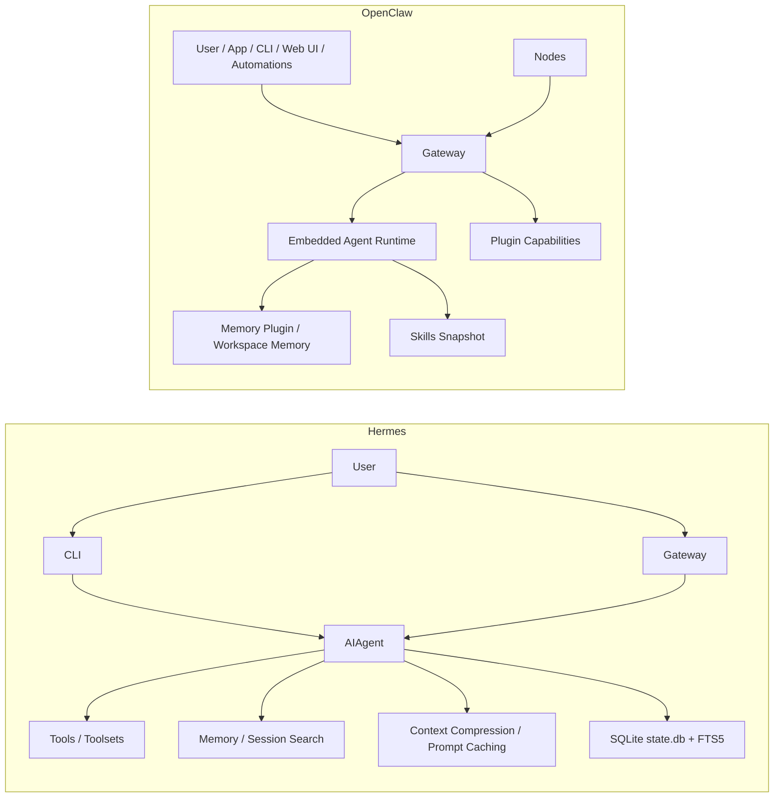
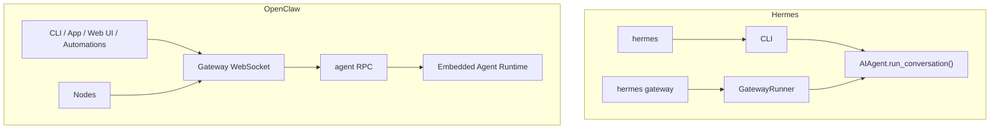
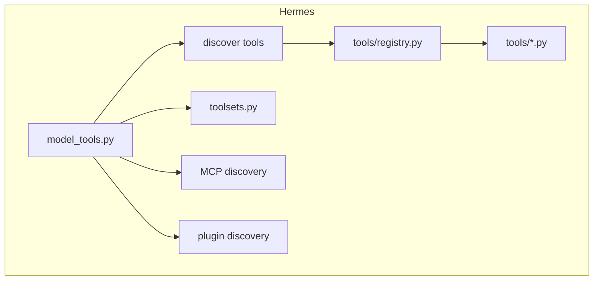
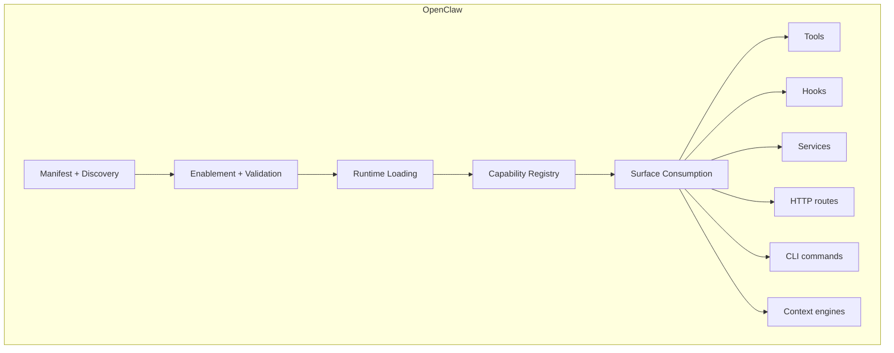
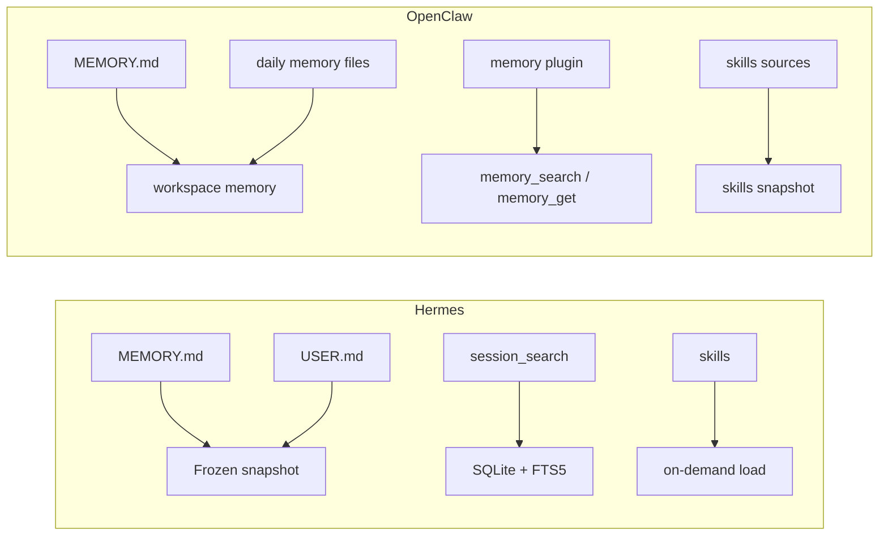

# Hermes vs OpenClaw 架构图对照版

## 1. 总体架构中心对照

```mermaid
flowchart LR
    subgraph H["Hermes"]
        HU["User"] --> HCLI["CLI"]
        HU --> HGW["Gateway"]
        HCLI --> HA["AIAgent"]
        HGW --> HA
        HA --> HTOOLS["Tools / Toolsets"]
        HA --> HMEM["Memory / Session Search"]
        HA --> HCTX["Context Compression / Prompt Caching"]
        HA --> HDB["SQLite state.db + FTS5"]
    end

    subgraph O["OpenClaw"]
        OU["User / App / CLI / Web UI / Automations"] --> OGW["Gateway"]
        ON["Nodes"] --> OGW
        OGW --> OAG["Embedded Agent Runtime"]
        OGW --> OPLUG["Plugin Capabilities"]
        OAG --> OMEM["Memory Plugin / Workspace Memory"]
        OAG --> OSK["Skills Snapshot"]
    end
```

## 2. 入口对照

```mermaid
flowchart TD
    subgraph Hermes
        H1["hermes"] --> H2["CLI"]
        H3["hermes gateway"] --> H4["GatewayRunner"]
        H2 --> H5["AIAgent.run_conversation()"]
        H4 --> H5
    end

    subgraph OpenClaw
        O1["CLI / App / Web UI / Automations"] --> O2["Gateway WebSocket"]
        O3["Nodes"] --> O2
        O2 --> O4["agent RPC"]
        O4 --> O5["Embedded Agent Runtime"]
    end
```

## 3. 工具与扩展架构对照

```mermaid
flowchart TD
    subgraph Hermes
        HM["model_tools.py"] --> HD["discover tools"]
        HD --> HR["tools/registry.py"]
        HR --> HT["tools/*.py"]
        HM --> HTS["toolsets.py"]
        HM --> HMCP["MCP discovery"]
        HM --> HP["plugin discovery"]
    end
```

```mermaid
flowchart TD
    subgraph OpenClaw
        OD["Manifest + Discovery"] --> OV["Enablement + Validation"]
        OV --> OR["Runtime Loading"]
        OR --> OC["Capability Registry"]
        OC --> OS["Surface Consumption"]
        OS --> OTOOLS["Tools"]
        OS --> OHOOK["Hooks"]
        OS --> OSVC["Services"]
        OS --> OHTTP["HTTP routes"]
        OS --> OCLI["CLI commands"]
        OS --> OCTX["Context engines"]
    end
```

## 4. 记忆与技能架构对照

```mermaid
flowchart LR
    subgraph Hermes
        HM1["MEMORY.md"] --> HP1["Frozen snapshot"]
        HM2["USER.md"] --> HP1
        HS1["session_search"] --> HDB1["SQLite + FTS5"]
        HK1["skills"] --> HA1["on-demand load"]
    end

    subgraph OpenClaw
        OM1["MEMORY.md"] --> OP1["workspace memory"]
        OM2["daily memory files"] --> OP1
        OMP["memory plugin"] --> OMT["memory_search / memory_get"]
        OS1["skills sources"] --> OS2["skills snapshot"]
    end
```

## 一句话总结

- Hermes：Agent Runtime 中心化架构
- OpenClaw：Gateway 中心化架构
