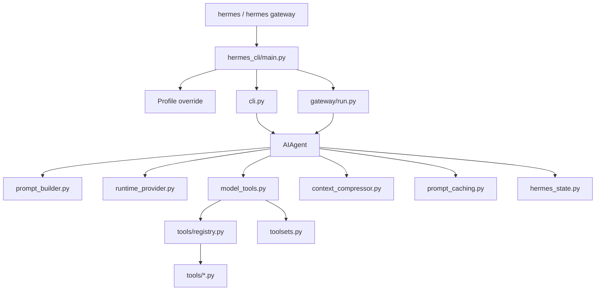
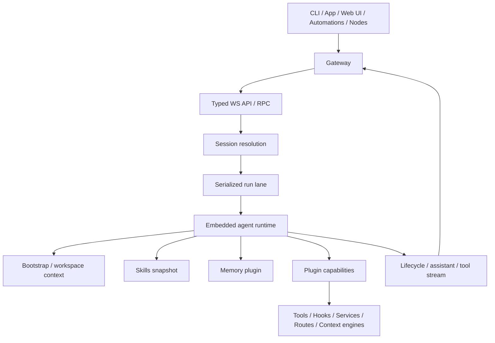

# Hermes vs OpenClaw 模块调用链对照版

## 一句话总览

- Hermes：`入口 -> AIAgent -> tool resolution -> model loop -> tools -> session db`
- OpenClaw：`入口 -> Gateway -> session/run orchestration -> embedded agent runtime -> plugins/capabilities -> stream back`

## 1. Hermes 模块调用链

## 2. OpenClaw 模块调用链

## 3. 对照总结

| 阶段 | Hermes | OpenClaw |
|---|---|---|
| 第一核心模块 | `AIAgent` | Gateway |
| 工具能力来源 | `model_tools.py` + registry + toolsets | plugin capability registry |
| 记忆接入 | memory + `session_search` + SQLite | memory plugin + workspace memory |
| 结果回传 | `AIAgent` 直接回 CLI/Gateway | runtime events 回 Gateway，再转发 |

## 一句话总结

- Hermes：Agent 驱动调用链
- OpenClaw：Gateway 驱动调用链
