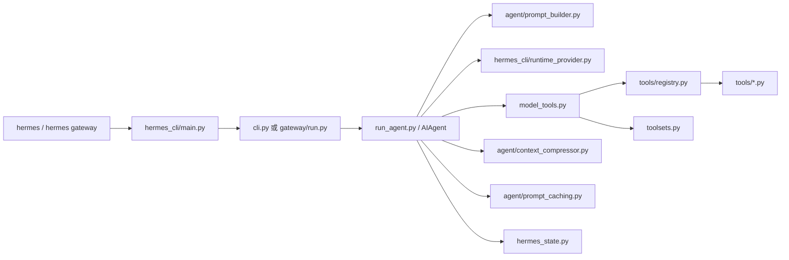
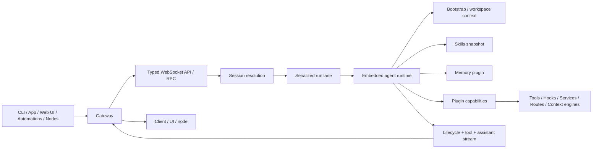

# Hermes / OpenClaw：从入口到一次完整执行的讲解版

## 说明

本文件分为两部分：

- Hermes：按当前仓库源码做逐文件讲解
- OpenClaw：按官方文档做逐模块链路讲解

## 一、Hermes：从入口到一次完整执行

### 总链路

### 1. `hermes_cli/main.py`

- 处理 `--profile/-p`
- 设置 `HERMES_HOME`
- 决定进入 CLI 还是 Gateway

### 2. `cli.py`

- 加载 CLI 配置
- 初始化 TUI
- 驱动 `AIAgent`

### 3. `gateway/run.py`

- 启动消息平台 gateway
- 加载 `.env` 与配置
- 把消息事件送入 agent runtime

### 4. `run_agent.py`

这是核心文件。

主要负责：

- `run_conversation()`
- 构建 prompt
- 获取工具 schema
- 调模型
- 执行工具
- 重试 / fallback / compression
- 持久化 session

### 5. `agent/prompt_builder.py`

- 拼装 system prompt
- 发现并加载 context files
- 扫描潜在 prompt injection

### 6. `hermes_cli/runtime_provider.py`

- 解析 provider
- 决定 api mode
- 输出运行时模型连接配置

### 7. `model_tools.py`

- import 工具模块
- 触发工具注册
- 解析 toolsets
- 生成 tool definitions
- 分发工具调用

### 8. `tools/registry.py`

- 保存工具元数据与 handler
- 向上提供 schema
- 向下 dispatch 调用

### 9. `toolsets.py`

- 定义工具集合
- 管理平台预设

### 10. `tools/*.py`

- 具体工具实现
- 在 import 时调用 `registry.register()`

### 11. `agent/context_compressor.py`

- 长上下文压缩

### 12. `agent/prompt_caching.py`

- Anthropic prompt caching

### 13. `hermes_state.py`

- SQLite session store
- FTS5 搜索

## 二、OpenClaw：从入口到一次完整执行

### 总链路

### 1. Gateway

- OpenClaw 系统中心
- 持有 messaging surfaces
- 管理 clients / nodes / events

### 2. Typed WS API / RPC

- 所有控制面请求先进入这里

### 3. Session resolution

- 先解析 session

### 4. Serialized run lane

- 同一 session 串行执行

### 5. Embedded agent runtime

- 真正执行 agent loop 的运行体

### 6. Bootstrap / workspace context

- 加载工作区上下文文件

### 7. Skills snapshot

- 技能形成会话级快照

### 8. Memory plugin

- 记忆工具来自 active memory plugin

### 9. Plugin capabilities

- 能力来自 plugin registry

### 10. Stream back to Gateway

- runtime 把 lifecycle / assistant / tool events 回传给 Gateway

## 三、正面对照总结

| 阶段 | Hermes | OpenClaw |
|---|---|---|
| 第一入口 | `main.py` | Gateway |
| 第一核心对象 | `AIAgent` | Gateway session/run orchestration |
| Prompt 组装 | `prompt_builder.py` | bootstrap/context loading |
| 工具能力解析 | `model_tools.py` + registry + toolsets | plugin capability registry |
| 记忆接入 | memory + `session_search` + SQLite | workspace memory + memory plugin |
| 结果回传 | `AIAgent` 直接回 CLI/Gateway | runtime events -> Gateway -> client |

## 一句话总结

- Hermes：看 `run_agent.py` 能抓住主链
- OpenClaw：看 Gateway Architecture + Agent Loop + Plugin Architecture 能抓住主链
