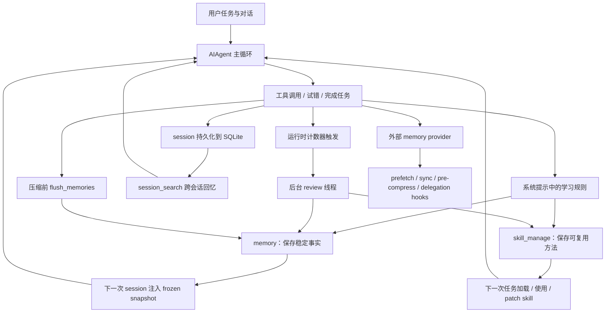

# Hermes 自主学习机制源码解读

## 说明

本文只依据当前仓库源码与项目内官方文档整理，不做额外推理。

讨论范围：

- Hermes 如何“自主学习”
- 自主学习的机制与原理
- 自主学习是如何设计的
- 这套设计的价值与可借鉴点
- 自主学习机制的特点

相关核心模块：

- `run_agent.py`
- `agent/prompt_builder.py`
- `tools/memory_tool.py`
- `tools/skill_manager_tool.py`
- `tools/session_search_tool.py`
- `agent/memory_manager.py`
- `agent/memory_provider.py`
- `agent/trajectory.py`

---

## 一、源码里“自主学习”具体指什么

README 对 learning loop 的描述包括：

- creates skills from experience
- improves them during use
- nudges itself to persist knowledge
- searches its own past conversations
- builds a deepening model of who you are across sessions

对应到源码，可以拆成 6 个部分：

1. 把稳定事实写入持久记忆
2. 把可复用的方法写成 skill
3. 定期自动触发后台复盘，判断是否保存 memory / skill
4. 在后续会话中重新注入 memory，重新检索历史 session
5. 在使用 skill 时发现问题后立即 patch
6. 可选保存 trajectory，供后续训练或分析使用

---

## 二、Hermes 如何“学”

### 1. 学稳定事实：memory

`tools/memory_tool.py` 将持久记忆定义为：

- `MEMORY.md`：agent 的个人笔记与观察，例如环境事实、项目约定、工具 quirks、things learned
- `USER.md`：agent 对用户的认识，例如偏好、沟通风格、期望、工作习惯

源码还明确写到：

- 两者在 session 开始时以 frozen snapshot 注入 system prompt
- 中途写入会立即落盘
- 但不会中途修改当前 system prompt

这说明 Hermes 学“稳定事实”的机制是：

- 用 `memory` 工具把内容写入持久文件
- 下一次 session 再重新注入这些记忆

### 2. 学可复用方法：skill

`tools/skill_manager_tool.py` 的 schema 描述里明确写：

- “Skills are your procedural memory — reusable approaches for recurring task types.”

源码支持的动作包括：

- `create`
- `patch`
- `edit`
- `delete`
- `write_file`
- `remove_file`

说明 Hermes 学“方法”时，不是继续往 memory 里堆，而是沉淀为 skill。

### 3. 学过去的经历：session_search

`tools/session_search_tool.py` 的说明是：

- 对 past sessions 做 FTS5 搜索
- 再把匹配到的 session 做 focused summaries
- 当前 session 会被排除

所以 Hermes 并不会把所有会话经验都硬塞进 memory，而是把历史会话存入数据库，需要时再检索。

---

## 三、自主学习机制的触发原理

### 1. 系统提示先规定“什么该学”

`agent/prompt_builder.py` 中有三段关键 guidance：

#### MEMORY_GUIDANCE

要求：

- 用 `memory` 保存 durable facts
- 保存用户偏好、环境细节、工具 quirks、稳定约定
- 不要把 task progress、session outcomes、temporary TODO state 写进 memory
- 新方法应该保存成 skill

#### SESSION_SEARCH_GUIDANCE

要求：

- 如果用户提到过去对话，或者怀疑跨会话上下文相关，先用 `session_search`

#### SKILLS_GUIDANCE

要求：

- 完成复杂任务（5+ tool calls）
- 修复 tricky error
- 发现 non-trivial workflow
- 都应使用 `skill_manage` 保存成 skill
- 如果 skill 过时、错误、不完整，要立即 patch

这说明自主学习的第一层机制是：

- 先通过 system prompt 把学习规则前置给模型

### 2. 运行时维护两套学习计数器

`run_agent.py` 初始化了：

- `_memory_nudge_interval`
- `_memory_flush_min_turns`
- `_turns_since_memory`
- `_iters_since_skill`
- `_skill_nudge_interval`

说明 Hermes 不只依赖模型自觉，还通过运行时计数器周期性推动学习行为。

---

## 四、memory 和 skill 是怎么被触发的

### 1. memory 触发

在 `run_conversation()` 中：

- 每个用户 turn 会增加 `_user_turn_count`
- 如果 memory 工具可用且 memory store 存在，则增加 `_turns_since_memory`
- 达到 `_memory_nudge_interval` 后，触发 `_should_review_memory = True`

这意味着：

- memory review 是按用户轮次触发的

### 2. skill 触发

源码中 skill 的触发不是按用户轮次，而是按工具调用迭代：

- 每次 tool-calling iteration 都会 `_iters_since_skill += 1`
- 在 `run_conversation()` 结束后检查：
  - 如果 `_iters_since_skill >= _skill_nudge_interval`
  - 且 `skill_manage` 工具可用
  - 则触发 `_should_review_skills = True`

这意味着：

- skill review 是按“这轮任务中用了多少工具迭代”来推动的

---

## 五、后台复盘是如何工作的

### 1. `_spawn_background_review()`

这是自主学习闭环的核心执行器。

源码注释明确写：

- 它会启动后台线程
- 创建一个完整的 `AIAgent` fork
- 使用与主 session 相同的 model、tools、context
- 把 review prompt 当作下一条 user turn 追加进 forked conversation
- 直接写共享 memory/skill store
- 不修改主对话历史，也不产生用户可见输出

### 2. 复盘 prompt

源码中定义了三种 prompt：

- `_MEMORY_REVIEW_PROMPT`
- `_SKILL_REVIEW_PROMPT`
- `_COMBINED_REVIEW_PROMPT`

其关注点分别是：

- 是否有值得保存的用户信息、偏好、行为期望
- 是否出现了经历试错、调整路线、可复用的非平凡方法
- 如果已有 skill，则 update；否则 create

### 3. 复盘的运行时机

在 `run_conversation()` 结束后，如果：

- 有 final response
- 没有被 interrupt
- 且满足 memory / skill review 条件

则启动后台 review。

源码注释明确写：

- review runs AFTER the response is delivered
- so it never competes with the user's task for model attention

这说明 Hermes 的自主学习是：

- 后台异步执行
- 不阻塞主任务

---

## 六、学到的东西存到哪里

### 1. memory

写入：

- `memories/MEMORY.md`
- `memories/USER.md`

MemoryStore 的源码特征包括：

- profile-scoped 路径
- 文件锁
- 原子写入
- 去重
- replace/remove
- 注入/外泄扫描
- 字符数上限

### 2. skill

写入 skill 目录体系，`skill_manage` 成功后会清理 skill system prompt cache：

- `clear_skills_system_prompt_cache(clear_snapshot=True)`

说明 skill 写入后会影响未来 skill 提示上下文。

### 3. session history

不是写到 memory，而是进入 session 数据库，由 `session_search` 负责后续回忆。

### 4. trajectory

如果启用 `save_trajectories`，会保存 JSONL 轨迹：

- `trajectory_samples.jsonl`
- `failed_trajectories.jsonl`

源码层面能确认它是轨迹保存工具。

---

## 七、学到的知识以后怎么再用

### 1. memory 重新注入

`MemoryStore.load_from_disk()` 会捕获 frozen snapshot。  
`format_for_system_prompt()` 返回的是 frozen snapshot，而不是 live state。

这意味着：

- 中途写 memory 不会影响当前 session system prompt
- 下一次 session 才会加载更新后的记忆

### 2. session_search 重新检索

`session_search` 会：

- FTS5 检索
- 去重
- 解析 delegation 子 session 到 parent lineage
- 截取与 query 相关的会话文本
- 并行 summarization

### 3. skill 重新加载与修补

`prompt_builder.py` 中明确要求：

- 如果 skill 匹配任务，就必须 load
- 如果 skill 有问题，立刻 patch

说明 skill 在 Hermes 中是：

- 可再次使用的过程知识
- 也是可持续修补的知识对象

---

## 八、压缩前记忆抢救机制

`run_agent.py` 中的 `flush_memories()` 是自主学习机制里很重要的一层。

源码说明：

- 在 compression、session reset、CLI exit 前调用
- 注入一条 flush message
- 发起一次只开放 memory 工具的 API call
- 执行其中的 memory tool calls
- 然后把 flush artifacts 从主消息历史中移除

flush prompt 的核心是：

- 会话正在被压缩
- 优先保存用户偏好、纠正、重复模式
- 不优先保存 task-specific details

这说明 Hermes 在上下文丢失前，会给模型一次“抢救记忆”的机会。

---

## 九、外部 memory provider 如何接入学习闭环

### 1. MemoryProvider 抽象接口

`agent/memory_provider.py` 定义了外部 memory provider 的生命周期接口：

- `initialize()`
- `system_prompt_block()`
- `prefetch()`
- `queue_prefetch()`
- `sync_turn()`
- `get_tool_schemas()`
- `handle_tool_call()`
- `shutdown()`

可选 hook：

- `on_turn_start()`
- `on_session_end()`
- `on_pre_compress()`
- `on_memory_write()`
- `on_delegation()`

### 2. MemoryManager 的编排作用

`agent/memory_manager.py` 明确说明：

- built-in provider 总是存在
- 最多允许一个 external provider

它负责：

- build_system_prompt
- prefetch_all
- queue_prefetch_all
- sync_all
- get_all_tool_schemas
- handle_tool_call
- on_pre_compress
- on_memory_write
- on_delegation

### 3. 在 `run_agent.py` 中的接线点

源码里直接接上了这些调用点：

- agent init 时激活 provider
- tool surface 注入 provider tool schemas
- tool loop 前 `prefetch_all()`
- turn 完成后 `sync_all()` 和 `queue_prefetch_all()`
- compression 前 `on_pre_compress()`
- built-in memory 写入时 `on_memory_write()`
- `delegate_task` 完成后 `on_delegation()`

说明 Hermes 的自主学习闭环并不限于本地 memory 文件，也可以扩展到外部记忆后端。

---

## 十、Hermes 自主学习闭环图

---

## 十一、设计特点

源码里能直接确认的特点包括：

1. 学习规则前置到 system prompt
2. memory 与 skill 分开存储
3. 会话历史与持久记忆分离
4. 后台 review 异步执行，不阻塞主任务
5. memory snapshot 冻结，保护 prompt 稳定性
6. skill 是可维护的过程记忆，不只是一次性创建
7. memory review 和 skill review 使用不同计数器
8. compression 前有记忆抢救机制
9. 外部 memory provider 使用统一接口接入学习闭环

---

## 十二、源码中可直接借鉴的做法

以下内容只总结源码已经明确体现的设计做法：

1. 把“稳定事实记忆”和“过程方法记忆”分成两套系统
2. 把“会话历史检索”与“持久记忆注入”分开
3. 用后台 review 处理学习，不阻塞主任务
4. 用 frozen snapshot 保护 system prompt 稳定性
5. 在 context compression 前先做一次记忆抢救
6. 把外部记忆后端抽象成标准 provider 接口
7. 要求在使用 skill 发现问题时立即 patch

---

## 十三、一句话总结

按源码严格总结，Hermes 的自主学习机制就是：

通过 system prompt 规定学习规则，用 `memory` 保存稳定事实，用 `skill_manage` 保存和修补可复用方法，用 `session_search` 回忆历史，用后台 review 周期性复盘是否该沉淀知识，并通过 memory provider 与 trajectory 机制把这个闭环扩展到外部记忆与训练数据留存。
