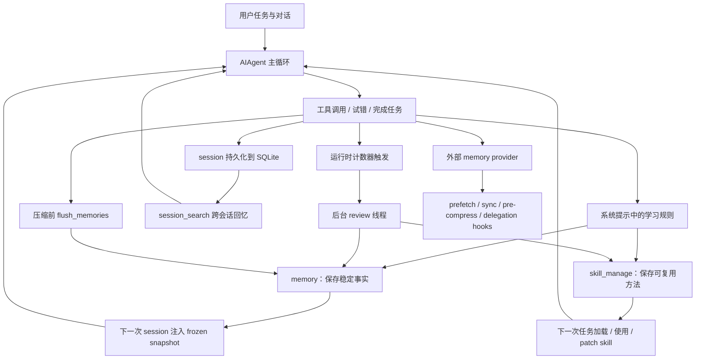
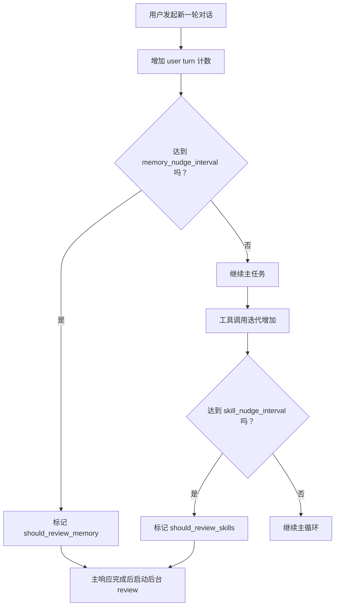
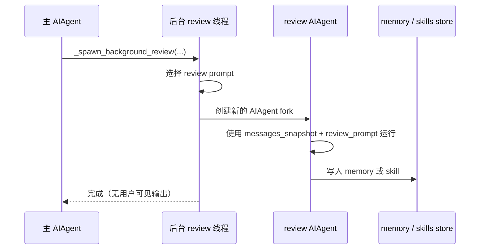
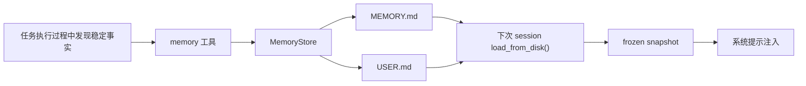
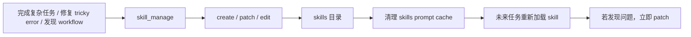
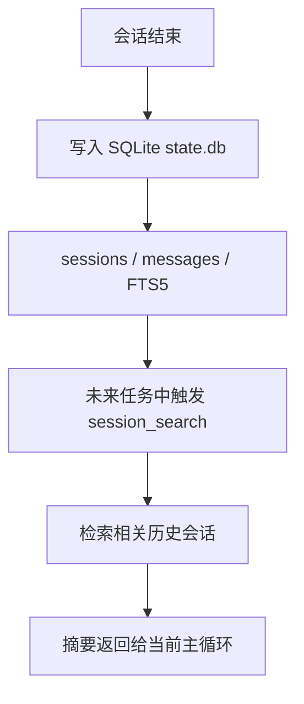
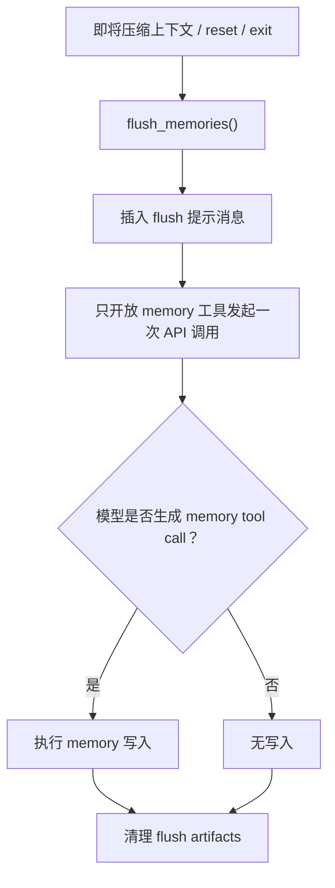
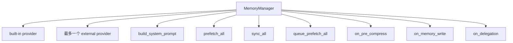
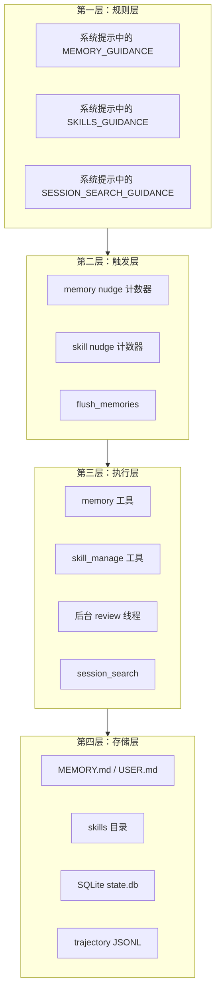
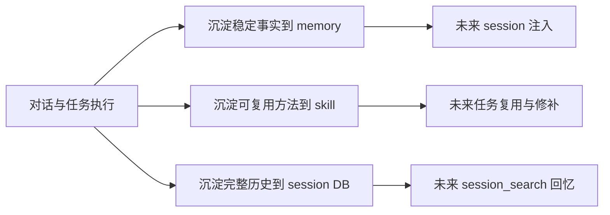

# Hermes 自主学习机制架构图版

## 说明

本文是 Hermes 自主学习机制的图解版，只基于当前仓库源码与项目内官方文档整理，用 Mermaid 图帮助理解其设计思路、运行机制与闭环结构。

---

## 1. Hermes 自主学习总体闭环图

---

## 2. 自主学习触发机制图

---

## 3. 后台 review 执行图

---

## 4. memory 学习机制图

---

## 5. skill 学习机制图

---

## 6. session_search 在学习闭环中的位置

---

## 7. flush_memories 机制图

---

## 8. 外部 memory provider 接入图

---

## 9. 自主学习分层图

---

## 10. 一句话理解图

---

## 11. 最压缩总结

Hermes 的自主学习图解可以概括为：

- system prompt 规定学习规则
- memory 保存稳定事实
- skill 保存可复用方法
- session_search 回忆历史会话
- background review 周期性复盘
- flush_memories 在压缩前抢救记忆
- memory provider 把学习闭环扩展到外部后端
