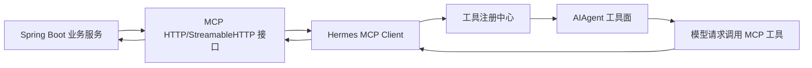
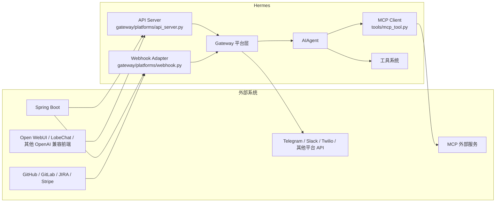
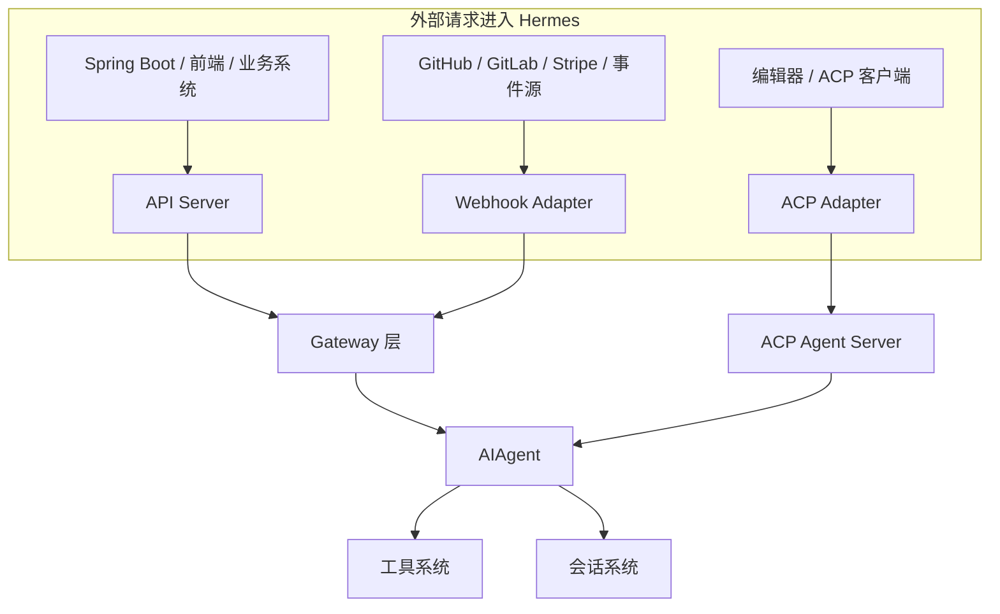
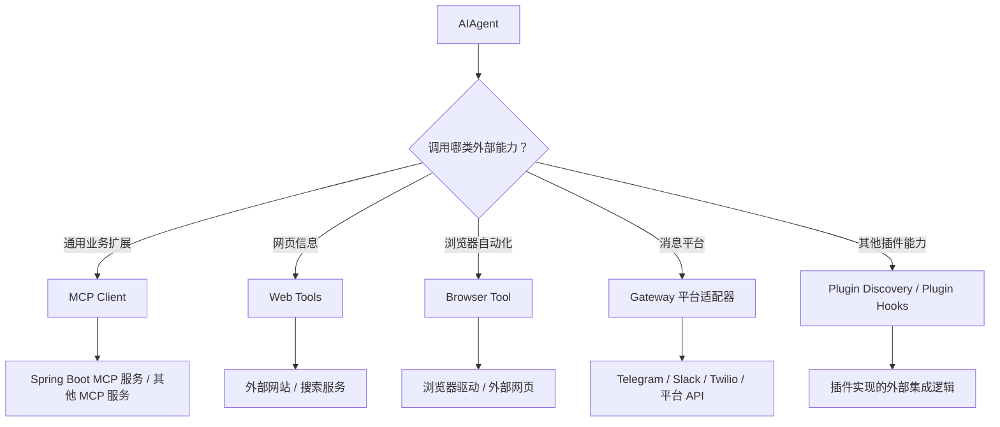

# Hermes 外部服务通讯源码解读

## 说明

本文只依据当前仓库源码与项目内官方说明整理，回答两个方向：

1. 外部服务如何请求 Hermes
2. Hermes 如何请求外部服务

重点结合 Spring Boot 场景说明。

相关核心模块：

- `gateway/platforms/api_server.py`
- `gateway/platforms/webhook.py`
- `acp_adapter/server.py`
- `tools/mcp_tool.py`
- `gateway/platforms/*`

---

## 一、外部服务如何请求 Hermes

从源码看，Hermes 对外暴露主要有三种正式入口：

1. OpenAI 兼容 API Server
2. Webhook
3. ACP Adapter

### 1. OpenAI 兼容 API Server

源码位置：

- `gateway/platforms/api_server.py`

该文件注释明确说明它暴露 HTTP 服务，并提供以下接口：

- `POST /v1/chat/completions`
- `POST /v1/responses`
- `GET /v1/responses/{response_id}`
- `DELETE /v1/responses/{response_id}`
- `GET /v1/models`
- `POST /v1/runs`
- `GET /v1/runs/{run_id}/events`
- `GET /health`

它的定位是：

- OpenAI-compatible API server
- 任何 OpenAI-compatible frontend 都能连接

因此如果是 Spring Boot 主动请求 Hermes，源码层面最标准的方式就是：

- Spring Boot 作为 HTTP client
- 调 Hermes 的 `/v1/chat/completions` 或 `/v1/responses`

### 2. Webhook

源码位置：

- `gateway/platforms/webhook.py`

文件注释明确说明：

- 它运行一个 `aiohttp` HTTP server
- 接收外部服务的 webhook POST
- 支持 GitHub、GitLab、JIRA、Stripe 等
- 校验 HMAC
- 把 payload 转成 agent prompt
- 再把结果投递回源头或其他平台

配置位置：

- `config.yaml -> platforms.webhook.extra.routes`

每个 route 可配置：

- `events`
- `secret`
- `prompt`
- `skills`
- `deliver`
- `deliver_extra`

因此如果 Spring Boot 是事件生产方，也可以：

- 直接向 Hermes webhook 路由发 POST
- 让 Hermes 把事件转成 agent 执行

### 3. ACP Adapter

源码位置：

- `acp_adapter/server.py`

注释明确说明：

- “exposes Hermes Agent via the Agent Client Protocol”

这说明 ACP 是 Hermes 的另一个正式对外协议入口，适合 ACP 客户端或编辑器集成。

---

## 二、Hermes 如何请求外部服务

从源码看，Hermes 访问外部服务主要有四类路径：

1. MCP
2. Gateway 平台适配器
3. Web / Browser 工具
4. 插件扩展

### 1. MCP

源码位置：

- `tools/mcp_tool.py`

文件注释明确说明：

- Hermes 是 MCP client
- 能连接外部 MCP server
- 支持：
  - `stdio`
  - `HTTP/StreamableHTTP`
- 发现其工具并注册到 Hermes tool registry

配置位置：

- `~/.hermes/config.yaml`
- `mcp_servers`

这说明 Hermes 主动调用外部业务服务时，源码里最标准的方式就是：

- 把外部服务做成 MCP server
- Hermes 通过 `mcp_tool` 接入

### 2. Gateway 平台适配器

例如：

- `gateway/platforms/sms.py`
- `gateway/platforms/telegram.py`
- `gateway/platforms/slack.py`

这些适配器会主动请求外部平台 API，例如：

- Twilio REST API
- Telegram Bot API
- Slack HTTP API

但这类路径属于平台接入，不是通用业务服务接口。

### 3. Web / Browser 工具

对应模块：

- `tools/web_tools.py`
- `tools/browser_tool.py`

这类能力允许 Hermes 主动访问外部网站或浏览器环境，但更偏网页研究与浏览器自动化。

### 4. 插件扩展

Hermes 的 plugin discovery 也允许插件实现额外的外部服务集成逻辑，但源码主线中最清晰、最正式的仍然是 MCP。

---

## 三、Spring Boot 与 Hermes 通讯的三种标准模式

### 方案 A：Spring Boot 调 Hermes API Server

适合：

- 同步问答
- 任务请求
- 统一 AI/Agent HTTP 接口

### 方案 B：Spring Boot 推送事件给 Hermes Webhook

适合：

- 告警事件
- PR 事件
- 工单事件
- 审批流事件

### 方案 C：Hermes 调 Spring Boot MCP 服务

适合：

- 让 Hermes 把 Spring Boot 暴露的业务能力当成工具使用
- 工单查询、用户查询、审批服务、报表服务、知识库接口等

---

## 四、Spring Boot 调 Hermes 的伪代码示意

下面只是伪代码示意，用来表达通信结构，不代表仓库内现成代码。

### 1. 调用 `/v1/chat/completions`

```java
String url = "http://localhost:8642/v1/chat/completions";

Map<String, Object> payload = Map.of(
    "model", "hermes-agent",
    "messages", List.of(
        Map.of("role", "user", "content", "请帮我分析这个任务")
    )
);

HttpHeaders headers = new HttpHeaders();
headers.setContentType(MediaType.APPLICATION_JSON);

HttpEntity<Map<String, Object>> request = new HttpEntity<>(payload, headers);

ResponseEntity<String> response = restTemplate.postForEntity(
    url,
    request,
    String.class
);
```

### 2. 调用 `/v1/responses`

```java
String url = "http://localhost:8642/v1/responses";

Map<String, Object> payload = Map.of(
    "model", "hermes-agent",
    "input", "请根据当前上下文生成一个总结"
);

HttpHeaders headers = new HttpHeaders();
headers.setContentType(MediaType.APPLICATION_JSON);

HttpEntity<Map<String, Object>> request = new HttpEntity<>(payload, headers);

ResponseEntity<String> response = restTemplate.postForEntity(
    url,
    request,
    String.class
);
```

---

## 五、Spring Boot 推送 Webhook 给 Hermes 的伪代码示意

```java
String url = "http://localhost:8644/webhooks/github-review";

Map<String, Object> payload = Map.of(
    "eventType", "pull_request",
    "repo", "example/repo",
    "number", 123,
    "title", "Fix webhook bug"
);

HttpHeaders headers = new HttpHeaders();
headers.setContentType(MediaType.APPLICATION_JSON);
headers.add("X-GitHub-Event", "pull_request");
headers.add("X-Hub-Signature-256", "sha256=...");

HttpEntity<Map<String, Object>> request = new HttpEntity<>(payload, headers);

ResponseEntity<String> response = restTemplate.postForEntity(
    url,
    request,
    String.class
);
```

这里对应的是：

- Spring Boot 作为 webhook sender
- Hermes webhook adapter 做签名校验、route 匹配、prompt 渲染、agent 执行

---

## 六、Spring Boot 作为 MCP 服务供 Hermes 调用的接入草图

### 思路

按 Hermes 源码，最标准路径是：

1. Spring Boot 提供 MCP HTTP/StreamableHTTP 服务
2. Hermes 在 `config.yaml` 的 `mcp_servers` 中配置这个服务
3. Hermes 启动时连接 MCP server
4. 发现 MCP 工具
5. 把这些工具注册进 Hermes tool registry
6. 模型后续即可像调用内建工具一样调用 Spring Boot 暴露的能力

### 结构草图



### Hermes 配置草图

```yaml
mcp_servers:
  spring_backend:
    url: "http://localhost:9000/mcp"
    headers:
      Authorization: "Bearer your-token"
    timeout: 120
```

这段只是根据 `tools/mcp_tool.py` 注释中的配置格式整理出的示意。

---

## 七、Hermes 与外部服务通讯架构图

### 1. 对外通讯总图



### 2. 外部请求 Hermes 的架构图



### 3. Hermes 主动访问外部服务的架构图



---

## 八、最压缩的结论

按仓库源码最清晰的通信方式：

- Spring Boot -> Hermes：优先用 API Server
- Spring Boot 事件 -> Hermes：优先用 Webhook
- Hermes -> Spring Boot：优先把 Spring Boot 做成 MCP 服务

---

## 九、一句话总结

严格按源码说：

- 外部服务请求 Hermes，最标准走 `gateway/platforms/api_server.py` 或 `gateway/platforms/webhook.py`
- Hermes 请求外部业务服务，最标准走 `tools/mcp_tool.py`
