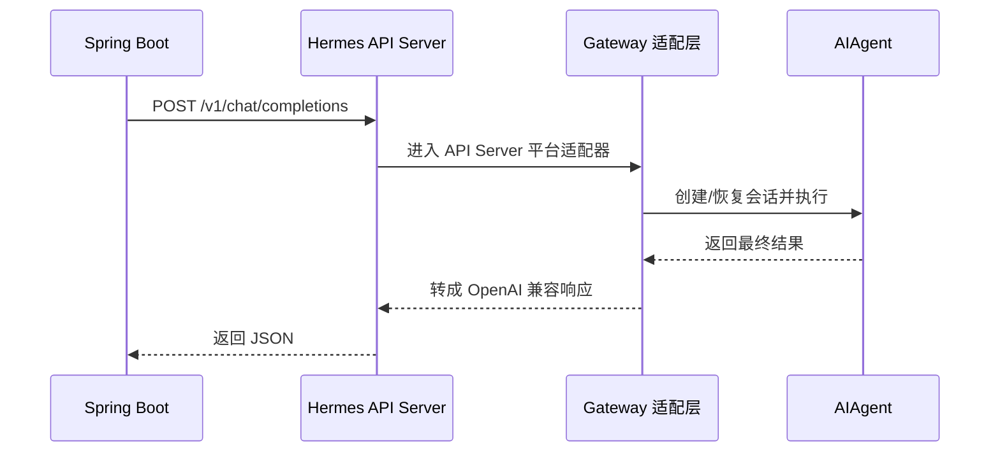
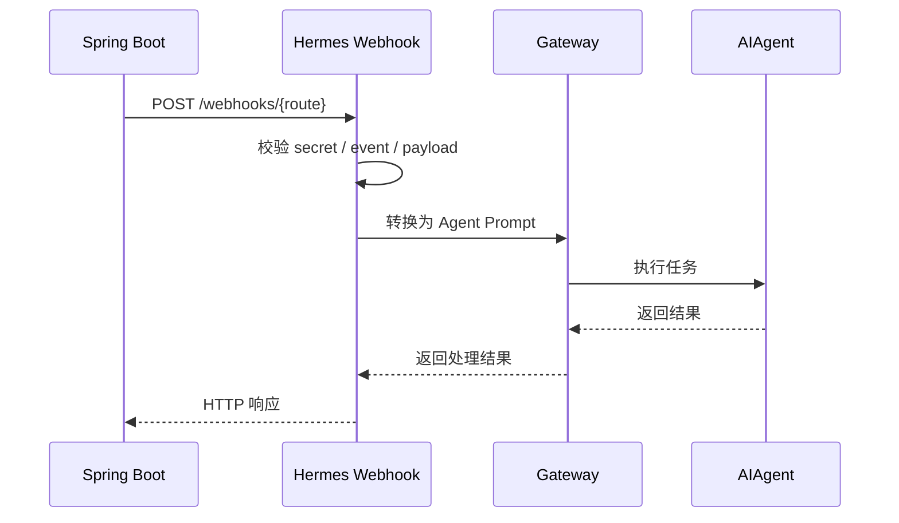
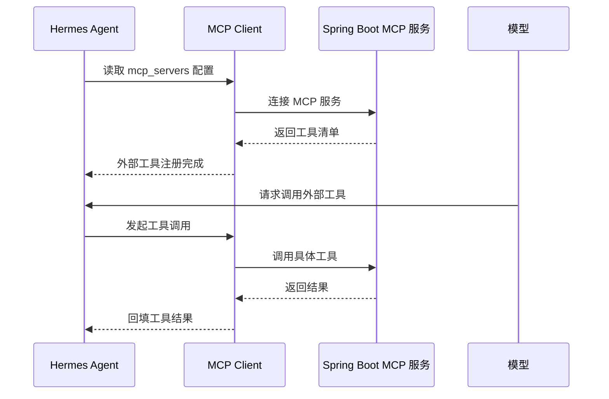

# Hermes 对接 Spring Boot 实战说明

说明：本文只按当前仓库源码与项目内官方说明整理，不补额外推理。

## 1. 目标

如果你的系统是 Spring Boot，而 Hermes 作为 Agent 侧能力，源码里最清晰的对接方式有三类：

1. Spring Boot 主动请求 Hermes
2. Spring Boot 把业务事件推送给 Hermes
3. Hermes 主动调用 Spring Boot 服务

对应源码入口分别是：

- `gateway/platforms/api_server.py`
- `gateway/platforms/webhook.py`
- `tools/mcp_tool.py`

## 2. 方式一：Spring Boot 主动请求 Hermes

这是最直接的服务对服务调用方式。

源码里 `gateway/platforms/api_server.py` 明确提供了 OpenAI 兼容 HTTP 接口：

- `POST /v1/chat/completions`
- `POST /v1/responses`
- `GET /v1/responses/{response_id}`
- `DELETE /v1/responses/{response_id}`
- `GET /v1/models`
- `POST /v1/runs`
- `GET /v1/runs/{run_id}/events`
- `GET /health`

### 2.1 推荐场景

适合：

- 问答式调用
- 任务式调用
- 统一成 OpenAI 兼容协议
- Spring Boot 把 Hermes 当成一个 Agent HTTP 服务

### 2.2 交互流程



### 2.3 Spring Boot 示例

```java
RestTemplate restTemplate = new RestTemplate();

String url = "http://127.0.0.1:8642/v1/chat/completions";

Map<String, Object> payload = new HashMap<>();
payload.put("model", "hermes");
payload.put("messages", List.of(
    Map.of("role", "user", "content", "请分析这个需求并给出执行建议")
));

HttpHeaders headers = new HttpHeaders();
headers.setContentType(MediaType.APPLICATION_JSON);

HttpEntity<Map<String, Object>> request = new HttpEntity<>(payload, headers);
ResponseEntity<String> response = restTemplate.postForEntity(url, request, String.class);
```

## 3. 方式二：Spring Boot 把事件推送给 Hermes

源码里 `gateway/platforms/webhook.py` 提供 webhook 入口。

它支持：

- 外部服务发起 HTTP POST
- HMAC 校验
- route 配置
- 把 payload 转成 prompt
- 再交给 Hermes 执行

### 3.1 推荐场景

适合：

- 工单事件
- PR / Issue 事件
- 告警事件
- 审批事件
- 定时事件推送

### 3.2 交互流程



### 3.3 Spring Boot 示例

```java
RestTemplate restTemplate = new RestTemplate();

String url = "http://127.0.0.1:8642/webhooks/business-alert";

Map<String, Object> payload = new HashMap<>();
payload.put("event", "order_failed");
payload.put("orderId", "A10086");
payload.put("message", "支付回调失败");

HttpHeaders headers = new HttpHeaders();
headers.setContentType(MediaType.APPLICATION_JSON);
headers.set("X-Hermes-Event", "order_failed");

HttpEntity<Map<String, Object>> request = new HttpEntity<>(payload, headers);
ResponseEntity<String> response = restTemplate.postForEntity(url, request, String.class);
```

## 4. 方式三：Hermes 主动调用 Spring Boot

源码里最标准的方式是 MCP。

`tools/mcp_tool.py` 明确说明：

- Hermes 是 MCP Client
- 可以连接外部 MCP Server
- 支持 `stdio`
- 支持 `HTTP/StreamableHTTP`
- 会自动发现远端服务暴露的工具
- 再注册进 Hermes 的工具系统

### 4.1 推荐场景

适合把 Spring Boot 封装成 Hermes 的业务能力，例如：

- 查询订单
- 查询用户
- 执行审批
- 获取报表
- 调用内部知识库
- 调用内部业务 API

### 4.2 交互流程



## 5. 推荐对接方式

如果按源码推荐路径来选：

### 5.1 Spring Boot -> Hermes

优先选：

- `API Server`

如果是事件驱动，再选：

- `Webhook`

### 5.2 Hermes -> Spring Boot

优先选：

- `MCP`

## 6. 三种方式的简表

| 方向 | 推荐方式 | 源码入口 | 适合场景 |
|---|---|---|---|
| Spring Boot 请求 Hermes | API Server | `gateway/platforms/api_server.py` | 同步问答、任务请求 |
| Spring Boot 推送事件到 Hermes | Webhook | `gateway/platforms/webhook.py` | 告警、工单、审批、PR 事件 |
| Hermes 请求 Spring Boot | MCP | `tools/mcp_tool.py` | 业务系统工具化接入 |

## 7. 一句话总结

严格按源码可以把 Spring Boot 与 Hermes 的实战接法记成一句话：

**“Spring Boot 调 Hermes，优先走 API Server；Spring Boot 推事件给 Hermes，走 Webhook；Hermes 调 Spring Boot，优先把 Spring Boot 做成 MCP 服务。”**
