# Hermes / OpenClaw 架构图手册

## 说明

本手册将前面对 Hermes 与 OpenClaw 架构、执行链路、工具调用、子代理机制、多 agent 机制相关的 Mermaid 图统一收拢到一个文档中，便于集中阅读、讲解与复用。

内容目标：

- 帮助理解 Hermes 的设计思路与架构风格
- 帮助理解 OpenClaw 的 Gateway 中心化设计
- 帮助对比 Hermes `delegate_task` 与 OpenClaw 多 agent 机制

说明：

- 图中的内容基于前面对官方文档与当前 Hermes 仓库结构的整理
- 本文档以理解架构为目的，偏教学型表达

---

## 一、Hermes 架构理解图

### 1. Hermes 总体架构图

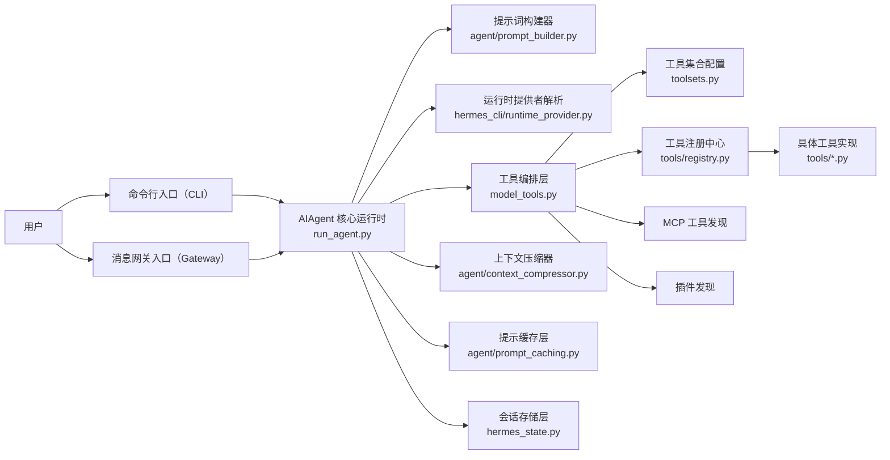
```mermaid
flowchart LR
    U["用户"] --> CLI["命令行入口（CLI）"]
    U --> GW["消息网关入口（Gateway）"]

    CLI --> AG["AIAgent 核心运行时<br/>run_agent.py"]
    GW --> AG

    AG --> PB["提示词构建器<br/>agent/prompt_builder.py"]
    AG --> RT["运行时提供者解析<br/>hermes_cli/runtime_provider.py"]
    AG --> MT["工具编排层<br/>model_tools.py"]
    AG --> CC["上下文压缩器<br/>agent/context_compressor.py"]
    AG --> PC["提示缓存层<br/>agent/prompt_caching.py"]
    AG --> DB["会话存储层<br/>hermes_state.py"]

    MT --> TS["工具集合配置<br/>toolsets.py"]
    MT --> REG["工具注册中心<br/>tools/registry.py"]
    REG --> TOOLS["具体工具实现<br/>tools/*.py"]
    MT --> MCP["MCP 工具发现"]
    MT --> PLUG["插件发现"]
```

### 2. Hermes 一次完整执行流程图

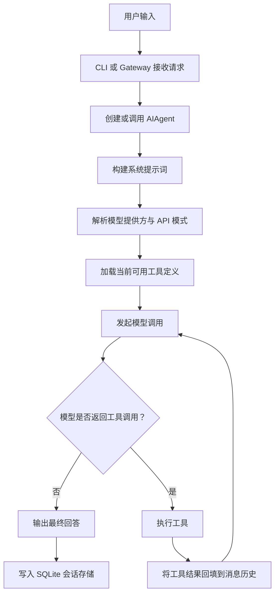
```mermaid
flowchart TD
    A["用户输入"] --> B["CLI 或 Gateway 接收请求"]
    B --> C["创建或调用 AIAgent"]
    C --> D["构建系统提示词"]
    D --> E["解析模型提供方与 API 模式"]
    E --> F["加载当前可用工具定义"]
    F --> G["发起模型调用"]

    G --> H{"模型是否返回工具调用？"}
    H -- 否 --> I["输出最终回答"]
    H -- 是 --> J["执行工具"]
    J --> K["将工具结果回填到消息历史"]
    K --> G

    I --> L["写入 SQLite 会话存储"]
```

### 3. Hermes 工具体系架构图

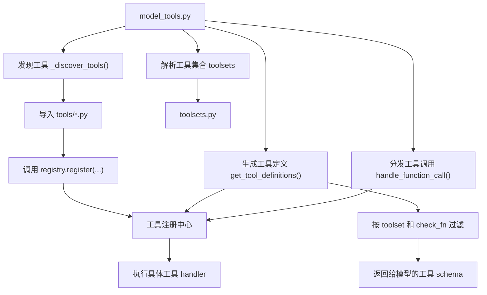
```mermaid
flowchart TD
    A["model_tools.py"] --> B["发现工具 _discover_tools()"]
    B --> C["导入 tools/*.py"]
    C --> D["调用 registry.register(...)"]
    D --> E["工具注册中心"]

    A --> F["解析工具集合 toolsets"]
    F --> G["toolsets.py"]

    A --> H["生成工具定义 get_tool_definitions()"]
    H --> E
    H --> I["按 toolset 和 check_fn 过滤"]
    I --> J["返回给模型的工具 schema"]

    A --> K["分发工具调用 handle_function_call()"]
    K --> E
    E --> L["执行具体工具 handler"]
```

### 4. Hermes 上下文治理架构图

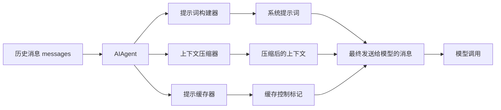
```mermaid
flowchart LR
    M["历史消息 messages"] --> A["AIAgent"]
    A --> B["提示词构建器"]
    A --> C["上下文压缩器"]
    A --> D["提示缓存器"]

    B --> E["系统提示词"]
    C --> F["压缩后的上下文"]
    D --> G["缓存控制标记"]

    E --> H["最终发送给模型的消息"]
    F --> H
    G --> H
    H --> I["模型调用"]
```

### 5. Hermes 会话与记忆架构图

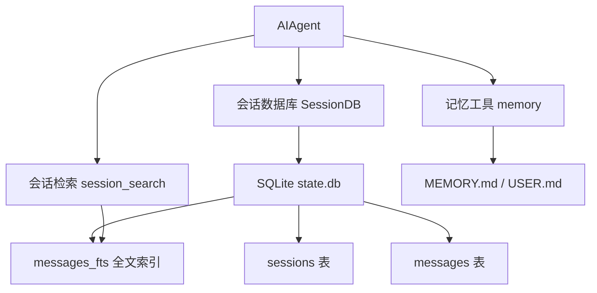
```mermaid
flowchart TD
    A["AIAgent"] --> B["记忆工具 memory"]
    A --> C["会话检索 session_search"]
    A --> D["会话数据库 SessionDB"]

    D --> E["SQLite state.db"]
    E --> F["sessions 表"]
    E --> G["messages 表"]
    E --> H["messages_fts 全文索引"]

    C --> H
    B --> I["MEMORY.md / USER.md"]
```

### 6. Hermes 多入口统一运行时图

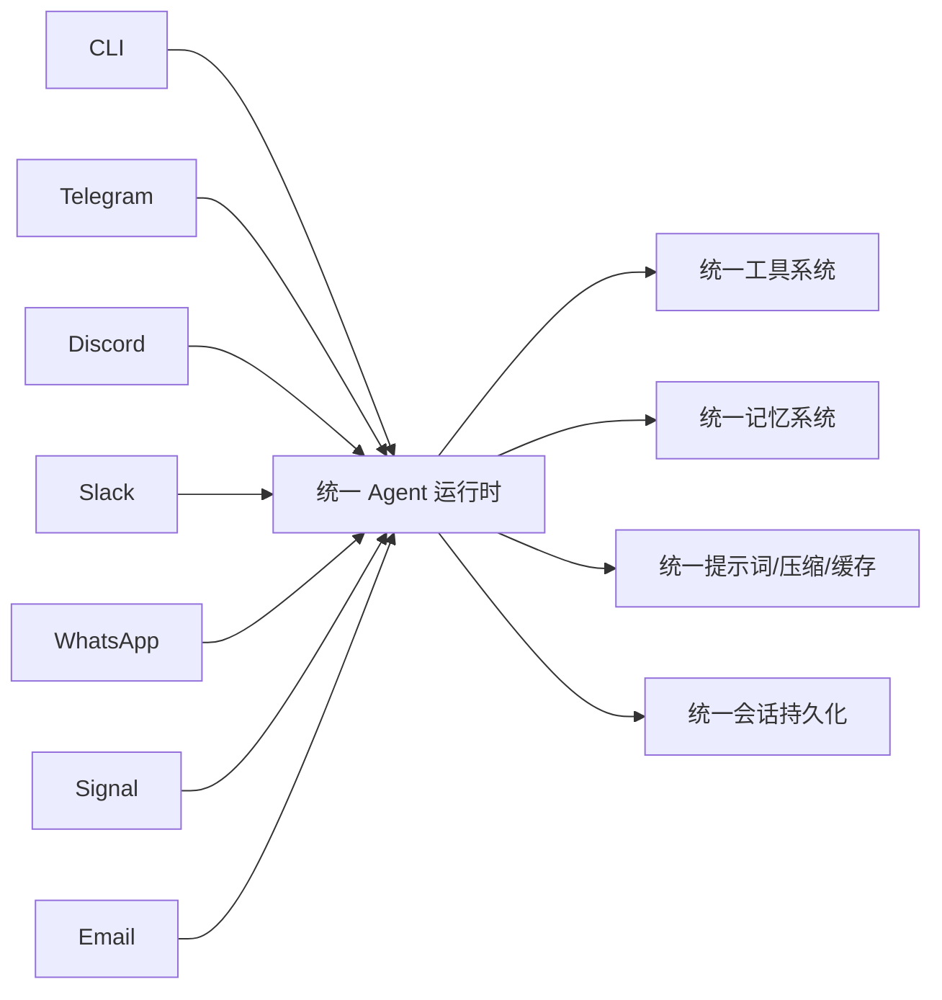
```mermaid
flowchart LR
    A["CLI"] --> X["统一 Agent 运行时"]
    B["Telegram"] --> X
    C["Discord"] --> X
    D["Slack"] --> X
    E["WhatsApp"] --> X
    F["Signal"] --> X
    G["Email"] --> X

    X --> H["统一工具系统"]
    X --> I["统一记忆系统"]
    X --> J["统一提示词/压缩/缓存"]
    X --> K["统一会话持久化"]
```

### 7. Hermes 架构分层图

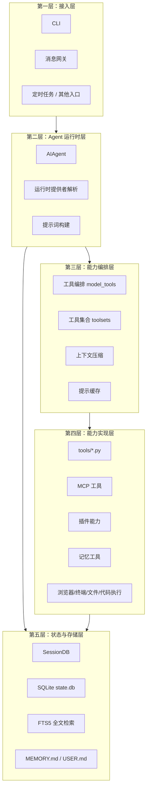
```mermaid
flowchart TD
    subgraph L1["第一层：接入层"]
        A1["CLI"]
        A2["消息网关"]
        A3["定时任务 / 其他入口"]
    end

    subgraph L2["第二层：Agent 运行时层"]
        B1["AIAgent"]
        B2["运行时提供者解析"]
        B3["提示词构建"]
    end

    subgraph L3["第三层：能力编排层"]
        C1["工具编排 model_tools"]
        C2["工具集合 toolsets"]
        C3["上下文压缩"]
        C4["提示缓存"]
    end

    subgraph L4["第四层：能力实现层"]
        D1["tools/*.py"]
        D2["MCP 工具"]
        D3["插件能力"]
        D4["记忆工具"]
        D5["浏览器/终端/文件/代码执行"]
    end

    subgraph L5["第五层：状态与存储层"]
        E1["SessionDB"]
        E2["SQLite state.db"]
        E3["FTS5 全文检索"]
        E4["MEMORY.md / USER.md"]
    end

    L1 --> L2
    L2 --> L3
    L3 --> L4
    L2 --> L5
    L4 --> L5
```

### 8. Hermes 核心模块依赖图

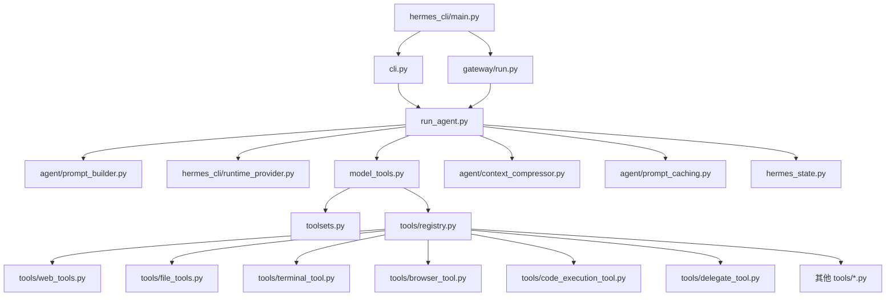
```mermaid
flowchart TD
    A["hermes_cli/main.py"] --> B["cli.py"]
    A --> C["gateway/run.py"]

    B --> D["run_agent.py"]
    C --> D

    D --> E["agent/prompt_builder.py"]
    D --> F["hermes_cli/runtime_provider.py"]
    D --> G["model_tools.py"]
    D --> H["agent/context_compressor.py"]
    D --> I["agent/prompt_caching.py"]
    D --> J["hermes_state.py"]

    G --> K["toolsets.py"]
    G --> L["tools/registry.py"]

    L --> M["tools/web_tools.py"]
    L --> N["tools/file_tools.py"]
    L --> O["tools/terminal_tool.py"]
    L --> P["tools/browser_tool.py"]
    L --> Q["tools/code_execution_tool.py"]
    L --> R["tools/delegate_tool.py"]
    L --> S["其他 tools/*.py"]
```

---

## 二、Hermes 工具调用图

### 9. Hermes 单次工具调用时序图

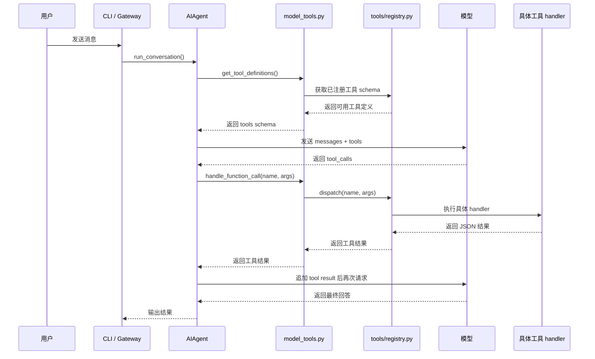
```mermaid
sequenceDiagram
    participant 用户
    participant 入口 as CLI / Gateway
    participant Agent as AIAgent
    participant 工具编排 as model_tools.py
    participant 注册中心 as tools/registry.py
    participant 模型
    participant 工具 as 具体工具 handler

    用户->>入口: 发送消息
    入口->>Agent: run_conversation()

    Agent->>工具编排: get_tool_definitions()
    工具编排->>注册中心: 获取已注册工具 schema
    注册中心-->>工具编排: 返回可用工具定义
    工具编排-->>Agent: 返回 tools schema

    Agent->>模型: 发送 messages + tools
    模型-->>Agent: 返回 tool_calls

    Agent->>工具编排: handle_function_call(name, args)
    工具编排->>注册中心: dispatch(name, args)
    注册中心->>工具: 执行具体 handler
    工具-->>注册中心: 返回 JSON 结果
    注册中心-->>工具编排: 返回工具结果
    工具编排-->>Agent: 返回工具结果

    Agent->>模型: 追加 tool result 后再次请求
    模型-->>Agent: 返回最终回答
    Agent-->>入口: 输出结果
```

### 10. Hermes 工具发现与暴露时序图

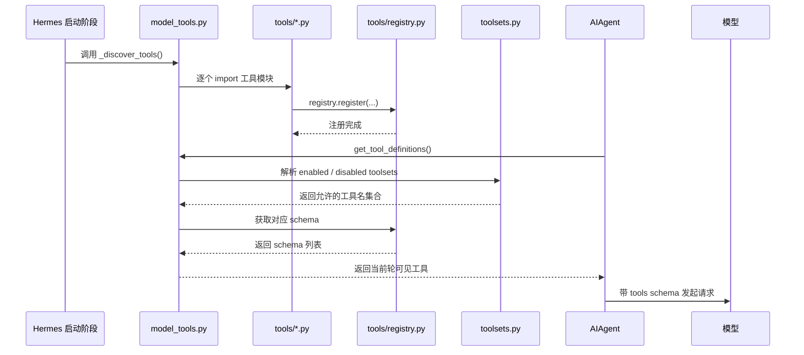
```mermaid
sequenceDiagram
    participant 启动 as Hermes 启动阶段
    participant 工具编排 as model_tools.py
    participant 工具模块 as tools/*.py
    participant 注册中心 as tools/registry.py
    participant 工具集合 as toolsets.py
    participant Agent as AIAgent
    participant 模型

    启动->>工具编排: 调用 _discover_tools()
    工具编排->>工具模块: 逐个 import 工具模块
    工具模块->>注册中心: registry.register(...)
    注册中心-->>工具模块: 注册完成

    Agent->>工具编排: get_tool_definitions()
    工具编排->>工具集合: 解析 enabled / disabled toolsets
    工具集合-->>工具编排: 返回允许的工具名集合
    工具编排->>注册中心: 获取对应 schema
    注册中心-->>工具编排: 返回 schema 列表
    工具编排-->>Agent: 返回当前轮可见工具
    Agent->>模型: 带 tools schema 发起请求
```

### 11. Hermes 工具调用循环时序图

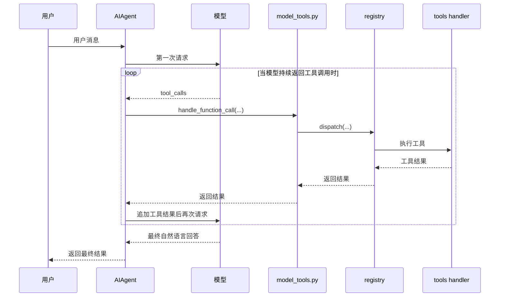
```mermaid
sequenceDiagram
    participant 用户
    participant Agent as AIAgent
    participant 模型
    participant 工具编排 as model_tools.py
    participant 注册中心 as registry
    participant 工具 as tools handler

    用户->>Agent: 用户消息
    Agent->>模型: 第一次请求

    loop 当模型持续返回工具调用时
        模型-->>Agent: tool_calls
        Agent->>工具编排: handle_function_call(...)
        工具编排->>注册中心: dispatch(...)
        注册中心->>工具: 执行工具
        工具-->>注册中心: 工具结果
        注册中心-->>工具编排: 返回结果
        工具编排-->>Agent: 返回结果
        Agent->>模型: 追加工具结果后再次请求
    end

    模型-->>Agent: 最终自然语言回答
    Agent-->>用户: 返回最终结果
```

### 12. Hermes 工具调用内部责任分工图

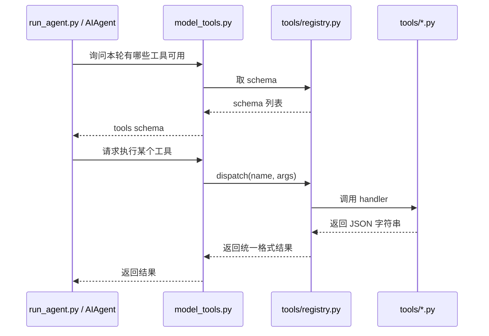
```mermaid
sequenceDiagram
    participant Agent as run_agent.py / AIAgent
    participant 工具编排 as model_tools.py
    participant 注册中心 as tools/registry.py
    participant 具体工具 as tools/*.py

    Agent->>工具编排: 询问本轮有哪些工具可用
    工具编排->>注册中心: 取 schema
    注册中心-->>工具编排: schema 列表
    工具编排-->>Agent: tools schema

    Agent->>工具编排: 请求执行某个工具
    工具编排->>注册中心: dispatch(name, args)
    注册中心->>具体工具: 调用 handler
    具体工具-->>注册中心: 返回 JSON 字符串
    注册中心-->>工具编排: 返回统一格式结果
    工具编排-->>Agent: 返回结果
```

### 13. Hermes 工具调用与会话持久化时序图

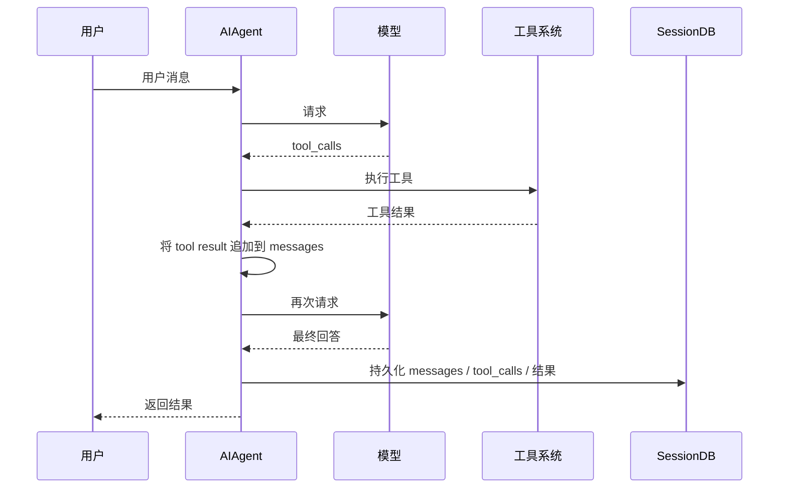
```mermaid
sequenceDiagram
    participant 用户
    participant Agent as AIAgent
    participant 模型
    participant 工具 as 工具系统
    participant 存储 as SessionDB

    用户->>Agent: 用户消息
    Agent->>模型: 请求
    模型-->>Agent: tool_calls
    Agent->>工具: 执行工具
    工具-->>Agent: 工具结果
    Agent->>Agent: 将 tool result 追加到 messages
    Agent->>模型: 再次请求
    模型-->>Agent: 最终回答
    Agent->>存储: 持久化 messages / tool_calls / 结果
    Agent-->>用户: 返回结果
```

---

## 三、Hermes delegate_task 子代理机制图

### 14. delegate_task 基础调用时序图

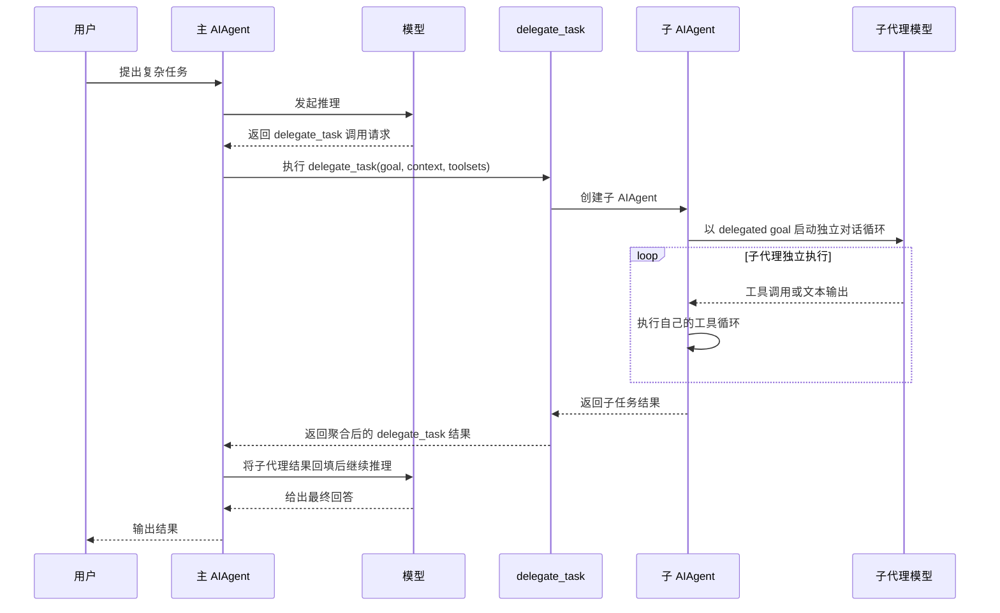
```mermaid
sequenceDiagram
    participant 用户
    participant 主代理 as 主 AIAgent
    participant 模型
    participant 委托工具 as delegate_task
    participant 子代理 as 子 AIAgent
    participant 子模型 as 子代理模型

    用户->>主代理: 提出复杂任务
    主代理->>模型: 发起推理
    模型-->>主代理: 返回 delegate_task 调用请求

    主代理->>委托工具: 执行 delegate_task(goal, context, toolsets)
    委托工具->>子代理: 创建子 AIAgent
    子代理->>子模型: 以 delegated goal 启动独立对话循环

    loop 子代理独立执行
        子模型-->>子代理: 工具调用或文本输出
        子代理->>子代理: 执行自己的工具循环
    end

    子代理-->>委托工具: 返回子任务结果
    委托工具-->>主代理: 返回聚合后的 delegate_task 结果

    主代理->>模型: 将子代理结果回填后继续推理
    模型-->>主代理: 给出最终回答
    主代理-->>用户: 输出结果
```

### 15. delegate_task 内部创建子代理时序图

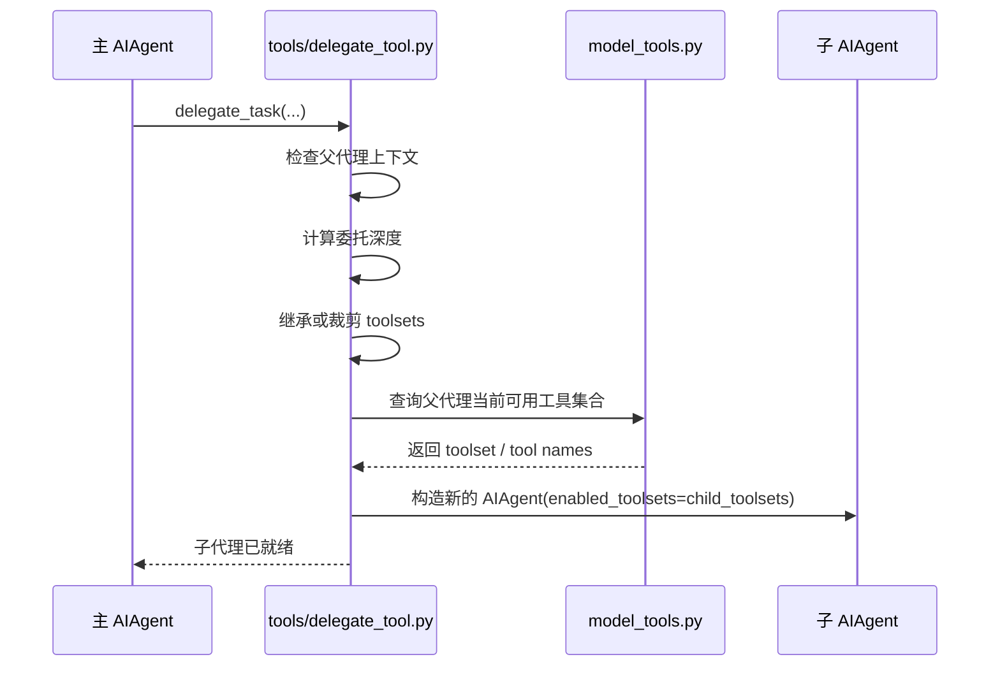
```mermaid
sequenceDiagram
    participant 主代理 as 主 AIAgent
    participant 委托工具 as tools/delegate_tool.py
    participant 工具编排 as model_tools.py
    participant 子代理 as 子 AIAgent

    主代理->>委托工具: delegate_task(...)
    委托工具->>委托工具: 检查父代理上下文
    委托工具->>委托工具: 计算委托深度
    委托工具->>委托工具: 继承或裁剪 toolsets
    委托工具->>工具编排: 查询父代理当前可用工具集合
    工具编排-->>委托工具: 返回 toolset / tool names
    委托工具->>子代理: 构造新的 AIAgent(enabled_toolsets=child_toolsets)
    委托工具-->>主代理: 子代理已就绪
```

### 16. delegate_task 与工具权限继承时序图

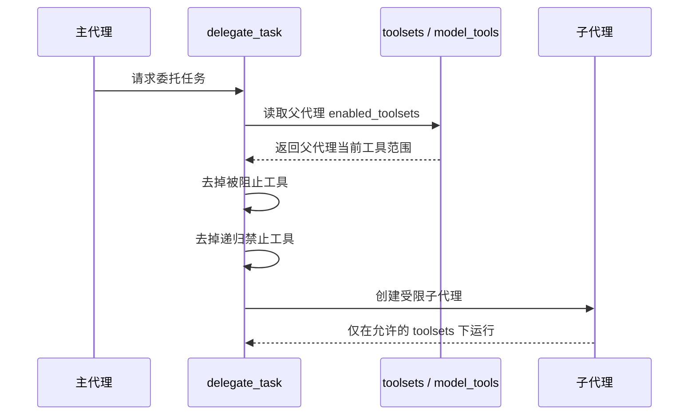
```mermaid
sequenceDiagram
    participant 主代理
    participant 委托工具 as delegate_task
    participant 工具集合 as toolsets / model_tools
    participant 子代理

    主代理->>委托工具: 请求委托任务
    委托工具->>工具集合: 读取父代理 enabled_toolsets
    工具集合-->>委托工具: 返回父代理当前工具范围
    委托工具->>委托工具: 去掉被阻止工具
    委托工具->>委托工具: 去掉递归禁止工具
    委托工具->>子代理: 创建受限子代理
    子代理-->>委托工具: 仅在允许的 toolsets 下运行
```

### 17. delegate_task 批量子任务时序图

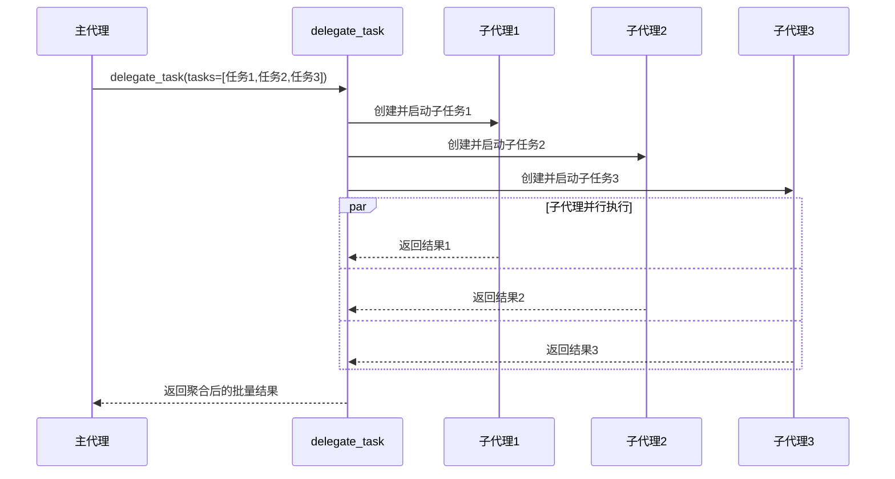
```mermaid
sequenceDiagram
    participant 主代理
    participant 委托工具 as delegate_task
    participant 子代理1
    participant 子代理2
    participant 子代理3

    主代理->>委托工具: delegate_task(tasks=[任务1,任务2,任务3])

    委托工具->>子代理1: 创建并启动子任务1
    委托工具->>子代理2: 创建并启动子任务2
    委托工具->>子代理3: 创建并启动子任务3

    par 子代理并行执行
        子代理1-->>委托工具: 返回结果1
    and
        子代理2-->>委托工具: 返回结果2
    and
        子代理3-->>委托工具: 返回结果3
    end

    委托工具-->>主代理: 返回聚合后的批量结果
```

### 18. 主代理与子代理的完整双层循环图

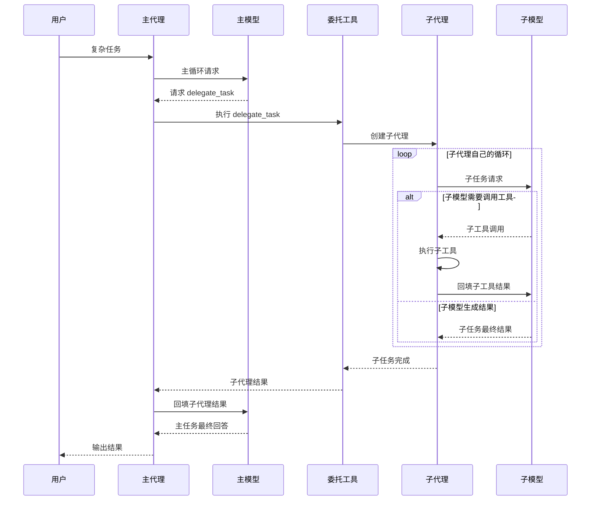
```mermaid
sequenceDiagram
    participant 用户
    participant 主代理
    participant 主模型
    participant 委托工具
    participant 子代理
    participant 子模型

    用户->>主代理: 复杂任务
    主代理->>主模型: 主循环请求
    主模型-->>主代理: 请求 delegate_task

    主代理->>委托工具: 执行 delegate_task
    委托工具->>子代理: 创建子代理

    loop 子代理自己的循环
        子代理->>子模型: 子任务请求
        alt 子模型需要调用工具
            子模型-->>子代理: 子工具调用
            子代理->>子代理: 执行子工具
            子代理->>子模型: 回填子工具结果
        else 子模型生成结果
            子模型-->>子代理: 子任务最终结果
        end
    end

    子代理-->>委托工具: 子任务完成
    委托工具-->>主代理: 子代理结果
    主代理->>主模型: 回填子代理结果
    主模型-->>主代理: 主任务最终回答
    主代理-->>用户: 输出结果
```

### 19. 普通工具调用 vs delegate_task 调用对照图

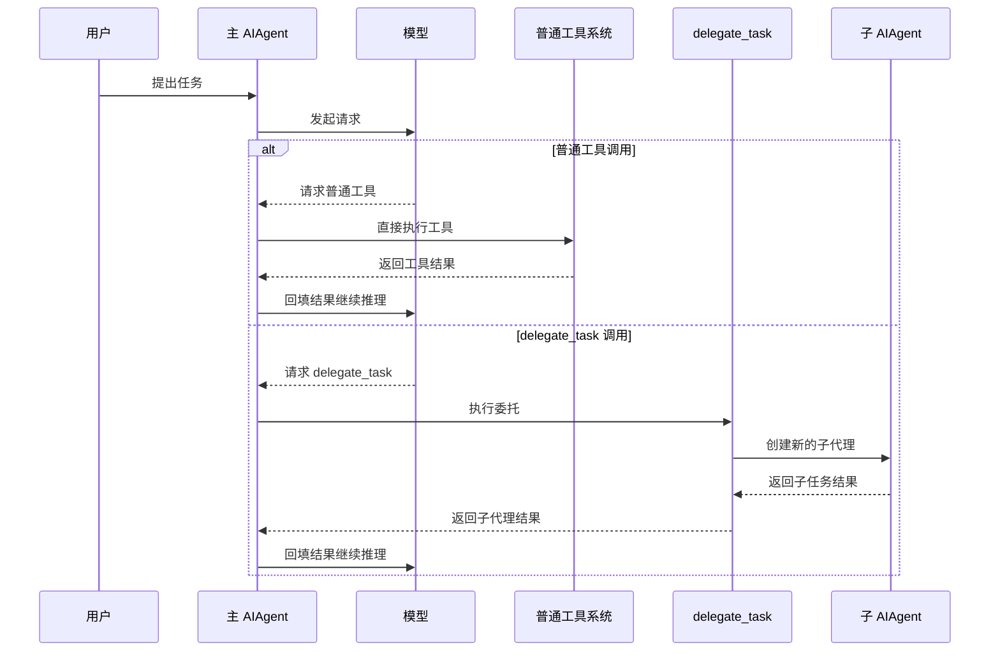
```mermaid
sequenceDiagram
    participant 用户
    participant 主代理 as 主 AIAgent
    participant 模型
    participant 普通工具 as 普通工具系统
    participant 委托工具 as delegate_task
    participant 子代理 as 子 AIAgent

    用户->>主代理: 提出任务
    主代理->>模型: 发起请求

    alt 普通工具调用
        模型-->>主代理: 请求普通工具
        主代理->>普通工具: 直接执行工具
        普通工具-->>主代理: 返回工具结果
        主代理->>模型: 回填结果继续推理
    else delegate_task 调用
        模型-->>主代理: 请求 delegate_task
        主代理->>委托工具: 执行委托
        委托工具->>子代理: 创建新的子代理
        子代理-->>委托工具: 返回子任务结果
        委托工具-->>主代理: 返回子代理结果
        主代理->>模型: 回填结果继续推理
    end
```

### 20. delegate_task 结构层级对照图

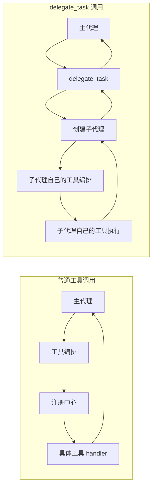
```mermaid
flowchart LR
    subgraph 普通工具调用
        A1["主代理"] --> B1["工具编排"]
        B1 --> C1["注册中心"]
        C1 --> D1["具体工具 handler"]
        D1 --> A1
    end

    subgraph delegate_task 调用
        A2["主代理"] --> B2["delegate_task"]
        B2 --> C2["创建子代理"]
        C2 --> D2["子代理自己的工具编排"]
        D2 --> E2["子代理自己的工具执行"]
        E2 --> C2
        C2 --> B2
        B2 --> A2
    end
```

---

## 四、Hermes 与 OpenClaw 架构对照图

### 21. Hermes vs OpenClaw 总体架构中心对照

```mermaid
flowchart LR
    subgraph H["Hermes"]
        HU["用户"] --> HCLI["CLI"]
        HU --> HGW["Gateway"]
        HCLI --> HA["AIAgent"]
        HGW --> HA
        HA --> HTOOLS["Tools / Toolsets"]
        HA --> HMEM["Memory / Session Search"]
        HA --> HCTX["Context Compression / Prompt Caching"]
        HA --> HDB["SQLite state.db + FTS5"]
    end

    subgraph O["OpenClaw"]
        OU["用户 / App / CLI / Web UI / Automations"] --> OGW["Gateway"]
        ON["Nodes"] --> OGW
        OGW --> OAG["Embedded Agent Runtime"]
        OGW --> OPLUG["Plugin Capabilities"]
        OAG --> OMEM["Memory Plugin / Workspace Memory"]
        OAG --> OSK["Skills Snapshot"]
    end
```

### 22. Hermes vs OpenClaw 入口对照

```mermaid
flowchart TD
    subgraph Hermes
        H1["hermes"] --> H2["CLI"]
        H3["hermes gateway"] --> H4["GatewayRunner"]
        H2 --> H5["AIAgent.run_conversation()"]
        H4 --> H5
    end

    subgraph OpenClaw
        O1["CLI / App / Web UI / Automations"] --> O2["Gateway WebSocket"]
        O3["Nodes"] --> O2
        O2 --> O4["agent RPC"]
        O4 --> O5["Embedded Agent Runtime"]
    end
```

### 23. Hermes vs OpenClaw 工具与扩展架构对照

```mermaid
flowchart TD
    subgraph Hermes
        HM["model_tools.py"] --> HD["discover tools"]
        HD --> HR["tools/registry.py"]
        HR --> HT["tools/*.py"]
        HM --> HTS["toolsets.py"]
        HM --> HMCP["MCP discovery"]
        HM --> HP["plugin discovery"]
    end
```

```mermaid
flowchart TD
    subgraph OpenClaw
        OD["Manifest + Discovery"] --> OV["Enablement + Validation"]
        OV --> OR["Runtime Loading"]
        OR --> OC["Capability Registry"]
        OC --> OS["Surface Consumption"]
        OS --> OTOOLS["Tools"]
        OS --> OHOOK["Hooks"]
        OS --> OSVC["Services"]
        OS --> OHTTP["HTTP routes"]
        OS --> OCLI["CLI commands"]
        OS --> OCTX["Context engines"]
    end
```

### 24. Hermes vs OpenClaw 记忆与技能架构对照

```mermaid
flowchart LR
    subgraph Hermes
        HM1["MEMORY.md"] --> HP1["Frozen snapshot"]
        HM2["USER.md"] --> HP1
        HS1["session_search"] --> HDB1["SQLite + FTS5"]
        HK1["skills"] --> HA1["on-demand load"]
    end

    subgraph OpenClaw
        OM1["MEMORY.md"] --> OP1["workspace memory"]
        OM2["daily memory files"] --> OP1
        OMP["memory plugin"] --> OMT["memory_search / memory_get"]
        OS1["skills sources"] --> OS2["skills snapshot"]
    end
```

### 25. Hermes vs OpenClaw 模块调用链对照

```mermaid
flowchart TD
    subgraph Hermes
        H0["hermes / hermes gateway"] --> H1["hermes_cli/main.py"]
        H1 --> H2["Profile override"]
        H1 --> H3["cli.py"]
        H1 --> H4["gateway/run.py"]
        H3 --> H5["AIAgent"]
        H4 --> H5
        H5 --> H6["prompt_builder.py"]
        H5 --> H7["runtime_provider.py"]
        H5 --> H8["model_tools.py"]
        H5 --> H9["context_compressor.py"]
        H5 --> H10["prompt_caching.py"]
        H5 --> H11["hermes_state.py"]
        H8 --> H12["tools/registry.py"]
        H8 --> H13["toolsets.py"]
        H12 --> H14["tools/*.py"]
    end

    subgraph OpenClaw
        O0["CLI / App / Web UI / Automations / Nodes"] --> O1["Gateway"]
        O1 --> O2["Typed WS API / RPC"]
        O2 --> O3["Session resolution"]
        O3 --> O4["Serialized run lane"]
        O4 --> O5["Embedded agent runtime"]
        O5 --> O6["Bootstrap / workspace context"]
        O5 --> O7["Skills snapshot"]
        O5 --> O8["Memory plugin"]
        O5 --> O9["Plugin capabilities"]
        O9 --> O10["Tools / Hooks / Services / Routes / Context engines"]
        O5 --> O11["Lifecycle / assistant / tool stream"]
        O11 --> O1
    end
```

### 26. Hermes delegate_task vs OpenClaw 多 agent 核心对照图

```mermaid
flowchart LR
    subgraph Hermes["Hermes：delegate_task"]
        H1["主代理"] --> H2["delegate_task 工具"]
        H2 --> H3["创建子代理"]
        H3 --> H4["子代理独立执行子任务"]
        H4 --> H3
        H3 --> H2
        H2 --> H1
    end

    subgraph OpenClaw["OpenClaw：多 agent 机制"]
        O1["Gateway"] --> O2["路由绑定 bindings"]
        O2 --> O3["目标 agentId"]
        O3 --> O4["该 agent 的独立工作区 / agentDir / sessions"]
        O4 --> O5["该 agent 执行请求"]
    end
```

### 27. Hermes delegate_task vs OpenClaw 多 agent 调用时序对照

```mermaid
sequenceDiagram
    participant 用户
    participant Hermes主代理 as Hermes 主代理
    participant Hermes委托 as delegate_task
    participant Hermes子代理 as Hermes 子代理
    participant 网关 as OpenClaw Gateway
    participant 路由 as 路由绑定
    participant OpenClawAgent as OpenClaw 目标 Agent

    alt Hermes delegate_task
        用户->>Hermes主代理: 提出复杂任务
        Hermes主代理->>Hermes委托: 执行 delegate_task
        Hermes委托->>Hermes子代理: 创建新的子代理
        Hermes子代理-->>Hermes委托: 返回子任务结果
        Hermes委托-->>Hermes主代理: 返回结果
    else OpenClaw 多 agent
        用户->>网关: 发起请求
        网关->>路由: 根据 bindings 选择 agent
        路由-->>网关: 返回目标 agentId
        网关->>OpenClawAgent: 把请求路由到该 agent
        OpenClawAgent-->>网关: 返回执行结果
        网关-->>用户: 返回结果
    end
```

### 28. Hermes delegate_task vs OpenClaw 多 agent 生命周期对照

```mermaid
flowchart TD
    subgraph Hermes["Hermes delegate_task 生命周期"]
        A1["主代理收到任务"] --> A2["模型决定调用 delegate_task"]
        A2 --> A3["创建子代理"]
        A3 --> A4["子代理完成子任务"]
        A4 --> A5["结果回到主代理"]
        A5 --> A6["子代理生命周期结束"]
    end

    subgraph OpenClaw["OpenClaw 多 agent 生命周期"]
        B1["Gateway 启动"] --> B2["已有多个 agent 配置"]
        B2 --> B3["每个 agent 拥有独立 workspace / agentDir / sessions"]
        B3 --> B4["请求进入后按 bindings 路由"]
        B4 --> B5["目标 agent 执行"]
        B5 --> B6["agent 持续存在，等待下一次请求"]
    end
```

### 29. Hermes delegate_task vs OpenClaw 多 agent 隔离边界对照

```mermaid
flowchart LR
    subgraph Hermes["Hermes delegate_task 隔离"]
        H1["主代理上下文"] --> H2["goal + context"]
        H2 --> H3["子代理新会话"]
        H3 --> H4["受限 toolsets"]
        H4 --> H5["独立终端会话"]
    end

    subgraph OpenClaw["OpenClaw 多 agent 隔离"]
        O1["Gateway"] --> O2["agentId"]
        O2 --> O3["独立 workspace"]
        O2 --> O4["独立 agentDir"]
        O2 --> O5["独立 sessions"]
        O2 --> O6["独立 auth profiles"]
    end
```

### 30. Hermes delegate_task vs OpenClaw 多 agent 设计目标对照

```mermaid
flowchart TD
    subgraph Hermes["Hermes delegate_task 的设计目标"]
        A["把复杂任务拆成子任务"]
        B["获得新上下文"]
        C["限制子代理工具范围"]
        D["并行执行最多多个子任务"]
        E["只把最终摘要带回主代理"]
    end

    subgraph OpenClaw["OpenClaw 多 agent 的设计目标"]
        F["在一个 Gateway 中承载多个隔离 agent"]
        G["每个 agent 对应独立人格/工作区/会话"]
        H["通过绑定规则把消息路由到不同 agent"]
        I["支持多账号/多通道/多人共享一个 Gateway"]
    end
```

### 31. Hermes delegate_task vs OpenClaw 多 agent 选型图

```mermaid
flowchart TD
    A["你的目标是什么？"] --> B{"重点是一次任务内部的拆分吗？"}

    B -- 是 --> C{"是否希望由主代理临时派生子代理？"}
    C -- 是 --> H["更偏 Hermes delegate_task"]
    C -- 否 --> D

    B -- 否 --> D{"重点是系统级长期存在的多个 agent 吗？"}
    D -- 是 --> E{"是否需要按路由/绑定规则把请求分配给不同 agent？"}
    E -- 是 --> O["更偏 OpenClaw 多 agent"]
    E -- 否 --> F

    D -- 否 --> F{"是否主要想做复杂任务拆分、并行子任务、上下文隔离？"}
    F -- 是 --> H
    F -- 否 --> G{"是否主要想做多人格、多工作区、多通道长期共存？"}
    G -- 是 --> O
    G -- 否 --> I["需要结合更具体场景判断"]

    H --> H1["典型特征：\n1. 主代理内部动态创建子代理\n2. 子代理短生命周期\n3. 目标是子任务拆分与并行\n4. 结果最终回到主代理"]
    O --> O1["典型特征：\n1. Gateway 中长期存在多个 agent\n2. 每个 agent 有独立工作区/状态\n3. 请求按绑定规则路由\n4. 目标是系统级多 agent 并存"]
```

### 32. Hermes / OpenClaw 多 agent 能力边界总结图

```mermaid
flowchart LR
    subgraph Hermes["Hermes delegate_task 能力边界"]
        H1["核心能力"]
        H1 --> H2["主代理运行中动态创建子代理"]
        H1 --> H3["子代理有独立对话循环"]
        H1 --> H4["支持子任务拆分"]
        H1 --> H5["支持批量/并行子任务"]
        H1 --> H6["子代理工具权限会被裁剪"]
        H1 --> H7["结果回流到主代理"]

        H8["边界特征"]
        H8 --> H9["不是系统级长期多 agent 编排"]
        H8 --> H10["子代理通常是短生命周期"]
        H8 --> H11["以当前任务为中心，不是平台级路由中心"]
    end

    subgraph OpenClaw["OpenClaw 多 agent 能力边界"]
        O1["核心能力"]
        O1 --> O2["Gateway 承载多个长期存在的 agent"]
        O1 --> O3["每个 agent 可有独立 workspace"]
        O1 --> O4["每个 agent 可有独立 state / sessions"]
        O1 --> O5["通过 routing bindings 选择目标 agent"]
        O1 --> O6["适合多人格/多角色/多通道并存"]

        O7["边界特征"]
        O7 --> O8["不是主代理临时派生子代理的任务拆分模型"]
        O7 --> O9["重点是系统级路由，不是一次任务内部委托"]
        O7 --> O10["agent 更偏长期存在的独立执行单元"]
    end
```

---

## 五、最推荐的阅读顺序

如果你是第一次阅读，建议按下面顺序看图：

1. Hermes 总体架构图
2. Hermes 架构分层图
3. Hermes 一次完整执行流程图
4. Hermes 工具体系架构图
5. Hermes 单次工具调用时序图
6. delegate_task 基础调用时序图
7. Hermes vs OpenClaw 总体架构中心对照
8. Hermes delegate_task vs OpenClaw 多 agent 核心对照图
9. Hermes delegate_task vs OpenClaw 多 agent 选型图
10. Hermes / OpenClaw 多 agent 能力边界总结图

---

## 六、一句话总结

Hermes 的图整体体现的是：

- 统一 Agent Runtime
- 工具系统模块化
- 上下文治理独立化
- 会话与记忆系统正式化
- `delegate_task` 用于任务内的子代理拆分

OpenClaw 的图整体体现的是：

- Gateway 中心化
- 插件能力模型是一等架构层
- 多 agent 是系统级长期存在的执行单元
- 请求通过绑定与路由进入对应 agent

---

## 七、Hermes 自主学习机制图

### 33. Hermes 自主学习总体闭环图

```mermaid
flowchart TD
    A["用户任务与对话"] --> B["AIAgent 主循环"]
    B --> C["工具调用 / 试错 / 完成任务"]

    C --> D["系统提示中的学习规则"]
    D --> E["memory：保存稳定事实"]
    D --> F["skill_manage：保存可复用方法"]

    C --> G["运行时计数器触发"]
    G --> H["后台 review 线程"]
    H --> E
    H --> F

    C --> I["session 持久化到 SQLite"]
    I --> J["session_search 跨会话回忆"]

    C --> K["压缩前 flush_memories"]
    K --> E

    C --> L["外部 memory provider"]
    L --> M["prefetch / sync / pre-compress / delegation hooks"]

    E --> N["下一次 session 注入 frozen snapshot"]
    F --> O["下一次任务加载 / 使用 / patch skill"]
    J --> B
    N --> B
    O --> B
```

### 34. Hermes 自主学习触发机制图

```mermaid
flowchart TD
    A["用户发起新一轮对话"] --> B["增加 user turn 计数"]
    B --> C{"达到 memory_nudge_interval 吗？"}
    C -- 是 --> D["标记 should_review_memory"]
    C -- 否 --> E["继续主任务"]

    E --> F["工具调用迭代增加"]
    F --> G{"达到 skill_nudge_interval 吗？"}
    G -- 是 --> H["标记 should_review_skills"]
    G -- 否 --> I["继续主循环"]

    D --> J["主响应完成后启动后台 review"]
    H --> J
```

### 35. Hermes 后台 review 执行图

```mermaid
sequenceDiagram
    participant 主代理 as 主 AIAgent
    participant review线程 as 后台 review 线程
    participant review代理 as review AIAgent
    participant 共享存储 as memory / skills store

    主代理->>review线程: _spawn_background_review(...)
    review线程->>review线程: 选择 review prompt
    review线程->>review代理: 创建新的 AIAgent fork
    review代理->>review代理: 使用 messages_snapshot + review_prompt 运行
    review代理->>共享存储: 写入 memory 或 skill
    review线程-->>主代理: 完成（无用户可见输出）
```

### 36. Hermes memory 学习机制图

```mermaid
flowchart LR
    A["任务执行过程中发现稳定事实"] --> B["memory 工具"]
    B --> C["MemoryStore"]
    C --> D["MEMORY.md"]
    C --> E["USER.md"]

    D --> F["下次 session load_from_disk()"]
    E --> F
    F --> G["frozen snapshot"]
    G --> H["系统提示注入"]
```

### 37. Hermes skill 学习机制图

```mermaid
flowchart LR
    A["完成复杂任务 / 修复 tricky error / 发现 workflow"] --> B["skill_manage"]
    B --> C["create / patch / edit"]
    C --> D["skills 目录"]
    D --> E["清理 skills prompt cache"]
    E --> F["未来任务重新加载 skill"]
    F --> G["若发现问题，立即 patch"]
```

### 38. Hermes session_search 在学习闭环中的位置

```mermaid
flowchart TD
    A["会话结束"] --> B["写入 SQLite state.db"]
    B --> C["sessions / messages / FTS5"]
    C --> D["未来任务中触发 session_search"]
    D --> E["检索相关历史会话"]
    E --> F["摘要返回给当前主循环"]
```

### 39. Hermes flush_memories 机制图

```mermaid
flowchart TD
    A["即将压缩上下文 / reset / exit"] --> B["flush_memories()"]
    B --> C["插入 flush 提示消息"]
    C --> D["只开放 memory 工具发起一次 API 调用"]
    D --> E{"模型是否生成 memory tool call？"}
    E -- 是 --> F["执行 memory 写入"]
    E -- 否 --> G["无写入"]
    F --> H["清理 flush artifacts"]
    G --> H
```

### 40. Hermes 外部 memory provider 接入图

```mermaid
flowchart TD
    A["MemoryManager"] --> B["built-in provider"]
    A --> C["最多一个 external provider"]

    A --> D["build_system_prompt"]
    A --> E["prefetch_all"]
    A --> F["sync_all"]
    A --> G["queue_prefetch_all"]
    A --> H["on_pre_compress"]
    A --> I["on_memory_write"]
    A --> J["on_delegation"]
```
