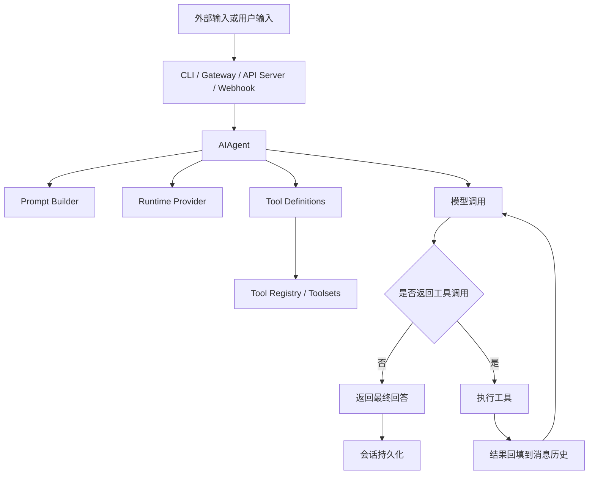

# 团队学习笔记：Hermes 源码学习与外部通讯整理

说明：

- 本文档是对本轮围绕 Hermes 的集中学习结果做的团队化沉淀。
- 内容来自今天对 **Hermes 官方文档、当前仓库源码结构、外部通讯相关实现、Spring Boot 对接示例** 的整理。
- 目标不是替代官方文档，而是给团队提供一份可快速上手、便于后续扩展和继续补充的学习笔记。
- 本轮中与 OpenClaw 的对比、自主学习机制、子代理机制等也有学习，但当前项目目录已经收敛为“外部通讯与 Spring 对接”主题，所以本文以该主题为主，并保留必要的 Hermes 核心背景。

---

## 1. 本轮学习目标

今天这一轮学习和整理，核心解决了下面几类问题：

1. Hermes 是什么，它能做什么
2. Hermes 的架构设计、运行机制、加载路径是什么
3. Hermes 的自主学习机制在源码里是如何落地的
4. Hermes 如何与外部服务通讯
5. Spring Boot 如何请求 Hermes
6. Hermes 如何请求 Spring Boot / 外部业务服务
7. 如何把这些认知落成团队内部可复用的示例工程和文档

---

## 2. 本轮已经沉淀出的项目结构

当前 `D:\spring_AI\hermes_spring` 已被整理成一个面向团队学习与外部集成的目录，顶层只保留：

- `README.md`
- `README-快速开始.md`
- `docs/`
- `example-spring-client/`
- `example-spring-mcp-server/`

这意味着：

- 不再保留整份 Hermes 源码副本
- 只保留与“外部系统如何接入 Hermes”相关的内容
- 更适合作为团队内部知识包、学习样例和对接起点

---

## 3. Hermes 是什么

结合本轮已整理的源码与文档理解，Hermes 可以先从下面几个角度理解：

1. **它是一个 Agent Runtime**
   有自己的对话循环、工具调用机制、会话存储、记忆和上下文管理。

2. **它是一个多入口系统**
   既可以从 CLI 进入，也可以从 Gateway 进入，还可以通过 API Server、Webhook、ACP 等方式被外部系统调用。

3. **它是一个带工具能力的执行型 Agent**
   在源码层面，它不是纯聊天模型包装，而是有工具注册、工具编排、工具执行和结果回填机制。

4. **它也是一个可扩展的外部能力接入点**
   通过 MCP、Webhook、平台适配器等机制，Hermes 可以与外部业务服务双向集成。

---

## 4. Hermes 的架构设计理解

### 4.1 核心理解

Hermes 的架构风格可以压缩成一句话：

**统一 Agent Runtime，多入口复用，多工具编排，多会话持久化。**

### 4.2 运行时主轴

从本轮源码阅读里，最关键的主轴是：

- `run_agent.py / AIAgent`
- `model_tools.py`
- `tools/registry.py`
- `toolsets.py`
- `hermes_state.py`
- `agent/prompt_builder.py`
- `agent/context_compressor.py`
- `agent/prompt_caching.py`

它们分别承担：

- AIAgent：主循环
- model_tools：工具发现、工具定义生成、工具分发
- registry：工具注册中心
- toolsets：工具暴露面控制
- state：会话与历史存储
- prompt_builder：系统提示构建
- context_compressor：长上下文压缩
- prompt_caching：缓存优化

### 4.3 设计风格

这套设计最值得团队记住的不是某一个文件，而是这几个风格特征：

1. **入口和运行时分离**
   CLI、Gateway、API Server、Webhook 都不是核心逻辑本体，核心逻辑在 Agent Runtime。

2. **编排和实现分离**
   工具编排在 `model_tools.py`，具体工具实现在 `tools/*.py`。

3. **上下文治理正式建模**
   提示词构建、压缩、缓存不是临时拼接，而是独立模块。

4. **会话与历史不是临时变量**
   通过 `SessionDB / SQLite / FTS5` 正式持久化。

---

## 5. Hermes 的运行机制与加载路径

本轮对源码的理解可以把 Hermes 的一次执行压缩成下面这条链路：

其中团队最应该掌握的点是：

1. **模型只决定“调用什么工具”**
2. **真正执行工具的是 Hermes 侧工具系统**
3. **工具结果会回填，再次进入模型推理**
4. **最终结果与会话一起持久化**

---

## 6. 本轮学习到的自主学习机制

虽然当前整理后的项目重点是“外部通讯”，但本轮也对 Hermes 的“自主学习”做了源码级整理。团队可以记住下面这个框架：

1. `memory`：保存稳定事实
2. `skill_manage`：保存可复用的方法
3. `session_search`：跨会话回忆历史
4. background review：后台复盘是否该沉淀 memory / skill
5. memory provider：支持外部记忆后端
6. trajectory：支持轨迹保存

最重要的设计认识是：

- Hermes 的“学习”不是一个魔法模块
- 而是一套由 **记忆、技能、会话搜索、复盘和外部记忆扩展** 组成的闭环

如果团队后续需要继续深入，这一块建议再单独拉一条主题线来讲。

---

## 7. 本轮学习重点：Hermes 与外部服务如何通讯

这是本轮最关键、也是当前项目保留下来的核心主题。

### 7.1 两个方向

Hermes 与外部服务通讯，本轮整理后可以稳定地分成两个方向：

1. **外部服务请求 Hermes**
2. **Hermes 请求外部服务**

### 7.2 外部服务请求 Hermes

源码层面最重要的三条入口：

1. `API Server`
2. `Webhook`
3. `ACP`

其中对团队最重要的是前两条。

#### API Server

Hermes 提供 OpenAI 兼容 HTTP 接口，适合外部系统把 Hermes 当成标准 AI/Agent 服务来调用。

重点特征：

- 标准 HTTP 方式接入
- 对 Spring Boot 非常友好
- 最适合同步请求和问答式调用

#### Webhook

Hermes 提供通用 webhook 接入点，适合外部业务系统把事件推送给 Hermes。

重点特征：

- 事件驱动
- 支持 route 配置
- 适合告警、工单、审批、PR、通知等异步事件场景

### 7.3 Hermes 请求外部服务

源码层面最标准的方式是：

- `MCP`

为什么团队要重点理解 MCP：

- 它是 Hermes 把外部服务接成“工具”的最清晰方式
- 对业务系统特别友好
- Spring Boot 这类系统非常适合被包装成 MCP 风格服务

也就是说：

- 如果外部系统想调用 Hermes：优先看 API Server / Webhook
- 如果 Hermes 想调用外部系统：优先看 MCP

---

## 8. Spring Boot 与 Hermes 的推荐集成方式

本轮已经把 Spring Boot 与 Hermes 的接法收敛成了一个很清晰的团队共识：

### 8.1 Spring Boot -> Hermes

优先方式：

- `API Server`

适合：

- 同步请求
- 问答式调用
- 业务分析请求
- 统一的服务调用入口

### 8.2 Spring Boot -> Hermes（事件驱动）

优先方式：

- `Webhook`

适合：

- 订单异常
- 支付失败
- 告警通知
- 审批回调
- 工单 / PR / Issue 事件

### 8.3 Hermes -> Spring Boot

优先方式：

- `MCP`

适合：

- 查询订单
- 查询用户
- 执行审批
- 调用业务 API
- 访问内部知识或报表能力

---

## 9. 当前两个示例工程分别解决什么问题

### 9.1 `example-spring-client`

这个工程是给团队看“**Spring Boot 如何主动调用 Hermes**”的。

当前已经具备：

- `RestTemplate` 版调用 Hermes
- `WebClient` 版调用 Hermes
- 同时支持调用 Hermes API Server 和 Hermes Webhook

适合团队成员：

- 快速看最小 Java 接入路径
- 做业务系统请求 Hermes 的起点工程
- 复制代码到自己的 Spring Boot 项目里做二次改造

### 9.2 `example-spring-mcp-server`

这个工程是给团队看“**Spring Boot 如何作为外部服务被 Hermes 调用**”的。

当前已经具备：

- 最小 MCP 风格 HTTP 接口
- `initialize`
- `tools/list`
- `tools/call`
- `ping`
- 三个业务化示例工具：
  - `query_order`
  - `query_user`
  - `approve_order`

并且现在已经升级成：

- 共享内存数据表
- 工具之间状态一致
- `approve_order` 执行后会真实修改订单状态

这对团队的价值非常直接：

- 它把“外部业务能力如何变成 Hermes 工具”这个概念具体化了
- 不再只是文档层面的说明，而是一个可运行、可编译、可讲解的教学工程

---

## 10. 团队推荐学习顺序

为了避免大家上来就看太散的内容，建议按下面顺序学习：

### 第一步：先理解整体背景

1. `README-快速开始.md`
2. `docs/learning/README.md`
3. `docs/learning/hermes-communication/01-hermes是什么与用途.md`
4. `docs/learning/hermes-communication/02-hermes如何使用与适用场景.md`

### 第二步：理解架构和运行机制

1. `03-hermes架构设计.md`
2. `04-hermes运行机制与底层加载原理.md`

### 第三步：理解外部通讯原理

1. `14-hermes-外部服务通讯源码解读.md`
2. `15-hermes-对接springboot实战说明.md`

### 第四步：看代码示例

1. `example-spring-client/README.md`
2. `example-spring-client` 源码
3. `example-spring-mcp-server/README.md`
4. `example-spring-mcp-server` 源码

---

## 11. 团队后续可以怎么维护这套知识

建议把这套资料当成团队内部“对接 Hermes 的知识底座”，后续按下面方式持续补充：

1. **文档层**
   新增“常见对接问题”“鉴权方式”“超时与重试策略”“生产部署建议”等专题。

2. **示例工程层**
   在 `example-spring-client` 里继续补：
   - 统一异常处理
   - 超时、重试、日志
   - 调用结果解析 DTO

3. **MCP 服务层**
   在 `example-spring-mcp-server` 里继续补：
   - 鉴权头
   - 真实 service / repository 分层
   - 更贴近业务的工具路由
   - 错误码和失败场景示例

4. **团队约定层**
   建议在后续真实接入时统一约定：
   - Hermes 的访问地址
   - API Server 的模型参数约定
   - Webhook route 命名规范
   - MCP 服务的认证和审计方式

---

## 12. 本轮学习的一句话总结

如果把今天整轮学习压成一句话，可以这样记：

**Hermes 的核心是统一 Agent Runtime；对外接入时，外部系统进 Hermes 主要走 API Server / Webhook，Hermes 出去调外部业务能力主要走 MCP；Spring Boot 则分别用 `example-spring-client` 和 `example-spring-mcp-server` 两个最小工程对应这两条集成方向。**

---

## 13. 建议作为团队知识库保留的入口

建议团队后续固定把下面几个入口作为长期保留资料：

- `README-快速开始.md`
- `docs/learning/README.md`
- `docs/learning/hermes-communication/14-hermes-外部服务通讯源码解读.md`
- `docs/learning/hermes-communication/15-hermes-对接springboot实战说明.md`
- `example-spring-client/README.md`
- `example-spring-mcp-server/README.md`

这样团队成员无论是：

- 想理解 Hermes 原理
- 想理解外部通讯机制
- 想做 Spring Boot 对接
- 想做 MCP 服务

都能从统一入口快速找到对应资料。
---

## 附：图谱手册

本轮涉及到的流程图、时序图、架构图已经单独整理为图谱文档，建议与本文配套阅读：

- `docs/团队学习图谱-Hermes架构流程与通讯时序.md`

如果团队成员更偏向图形化理解，可以先看这份图谱手册，再回来看本文的文字说明。