# 团队学习图谱：Hermes 架构流程与通讯时序

说明：

- 本文档把本轮学习过程中涉及到的 **流程图、时序图、架构图** 统一收拢，方便团队集中查看。
- 图主要围绕当前项目保留下来的主题：**Hermes 核心架构、工具调用、子代理机制、外部服务通讯、Spring Boot 对接**。
- 所有图均使用 Mermaid 表达，后续团队可以继续在此基础上追加。

---

## 1. Hermes 总体架构图

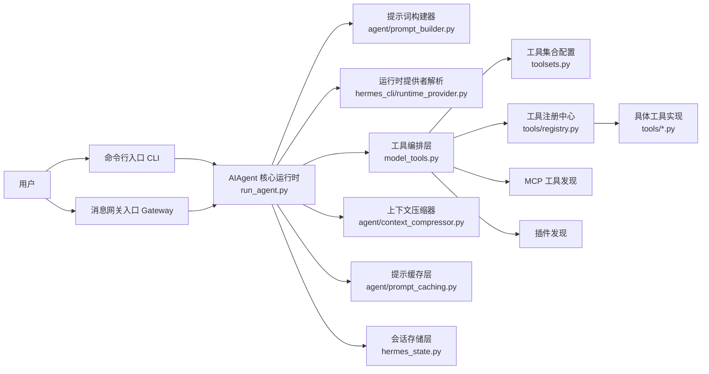

---

## 2. Hermes 一次完整执行流程图

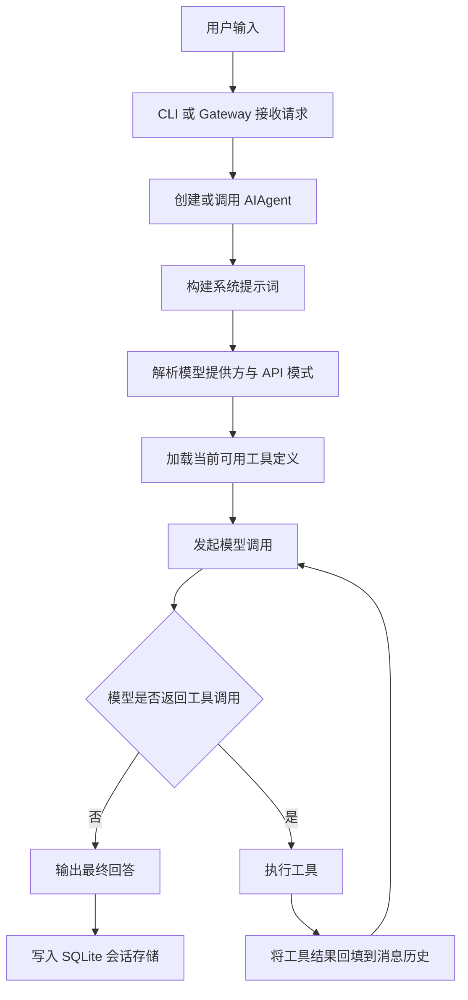

---

## 3. Hermes 工具体系架构图

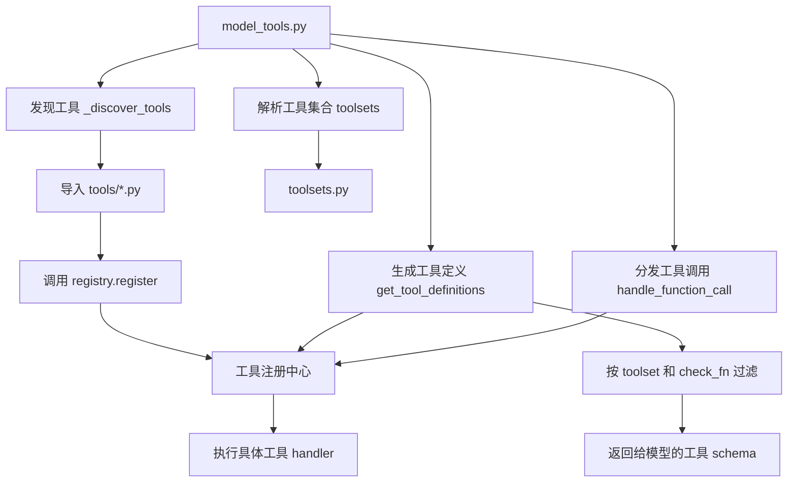

---

## 4. Hermes 上下文治理架构图

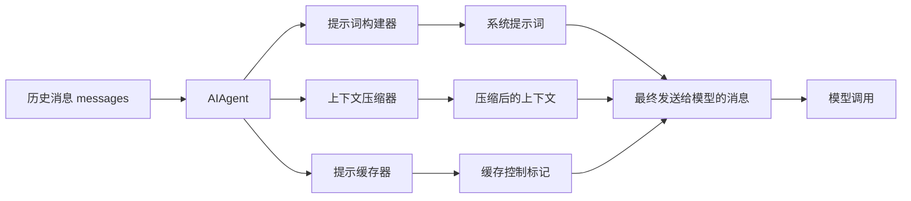

---

## 5. Hermes 会话与记忆架构图

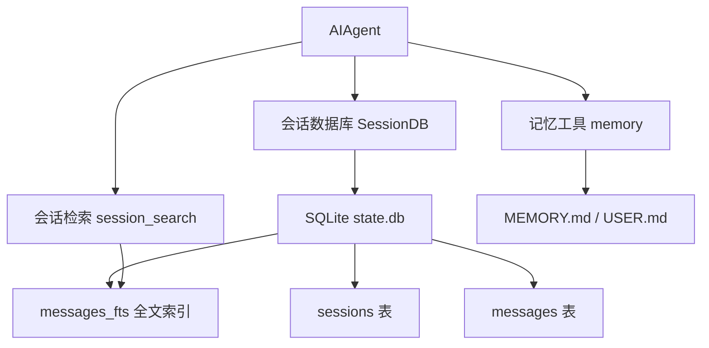

---

## 6. Hermes 多入口统一运行时图

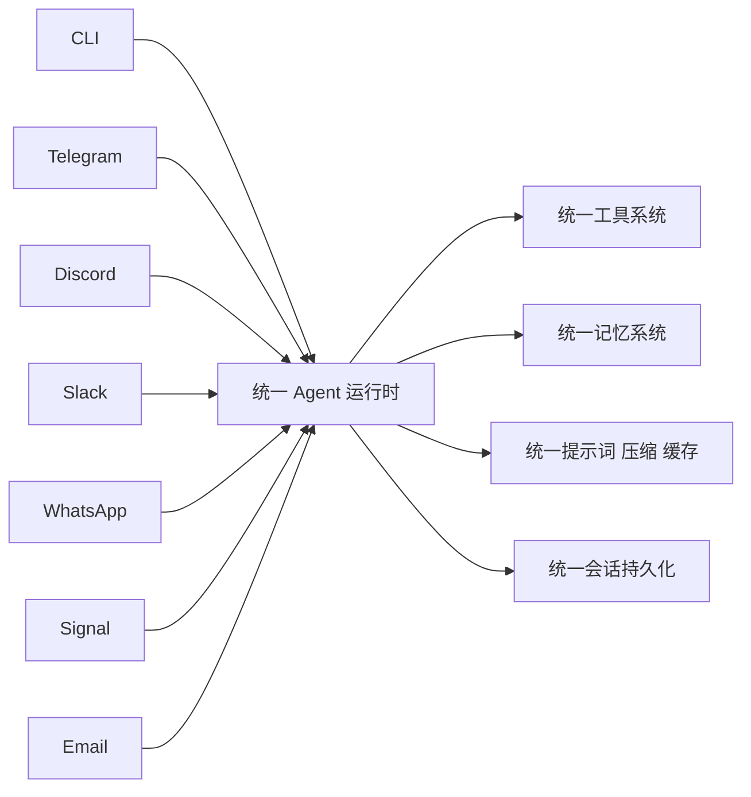

---

## 7. Hermes 架构分层图

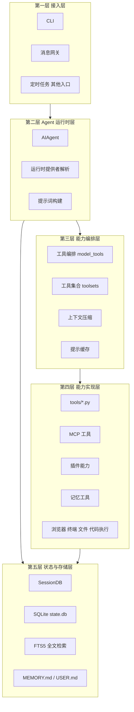

---

## 8. Hermes 核心模块依赖图

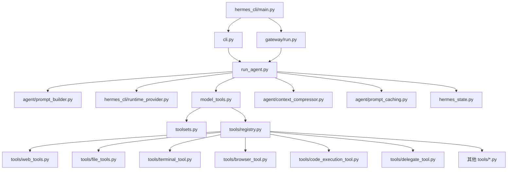

---

## 9. Hermes 单次工具调用时序图

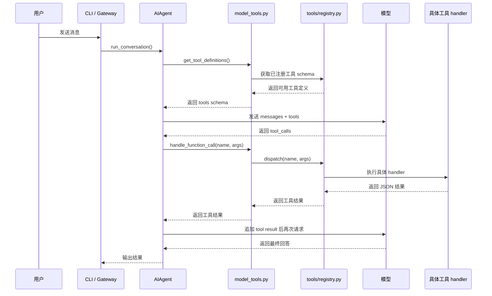

---

## 10. Hermes 工具发现与暴露时序图

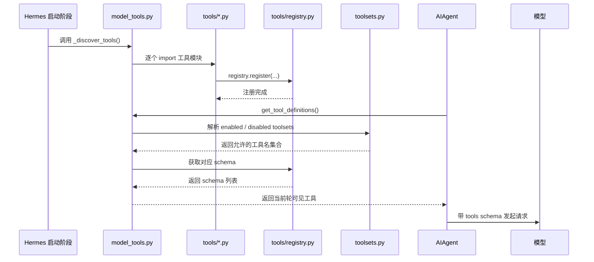

---

## 11. Hermes 工具调用循环时序图

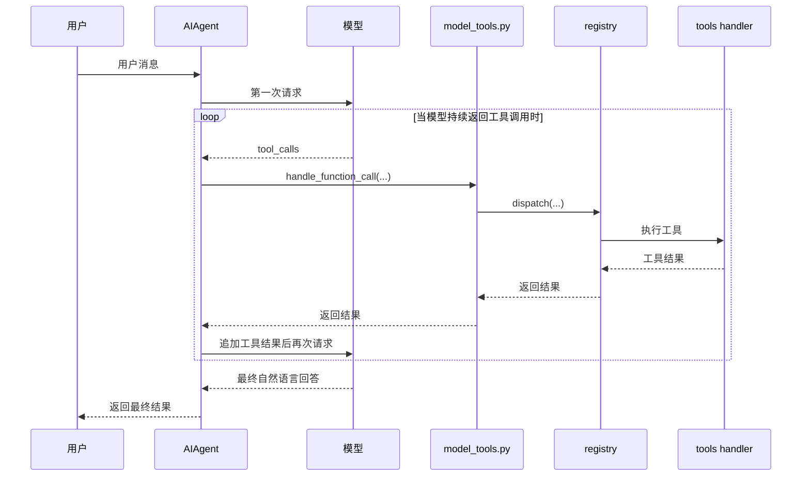

---

## 12. Hermes 普通工具调用 vs delegate_task 对照图

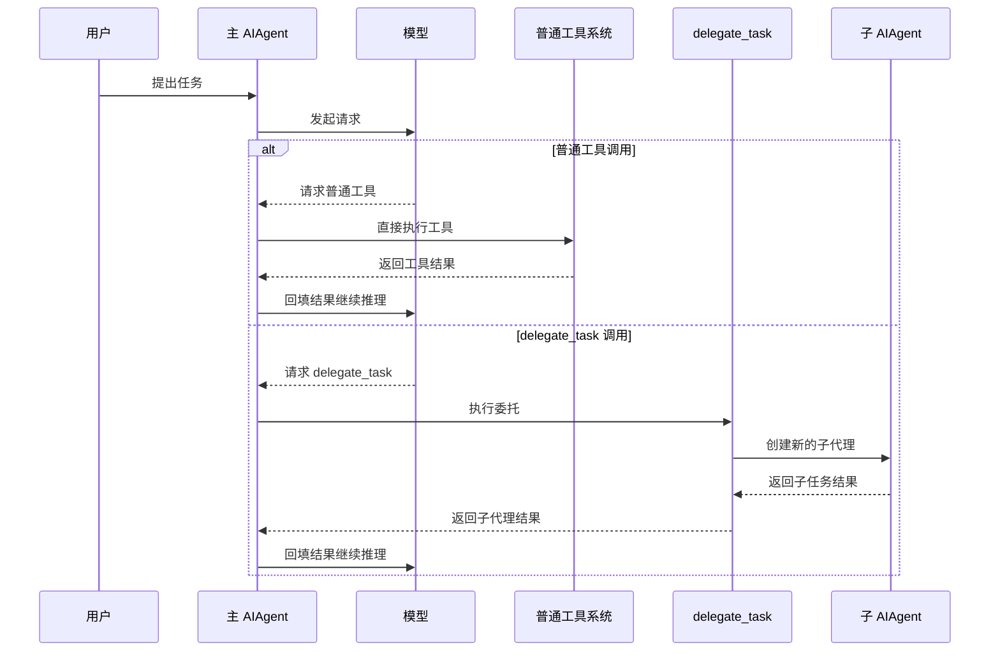

---

## 13. Hermes delegate_task 基础调用时序图

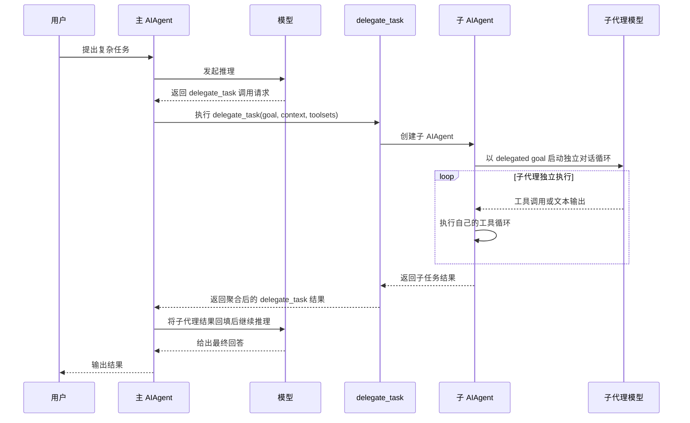

---

## 14. Hermes delegate_task 与 OpenClaw 多 agent 机制对照图

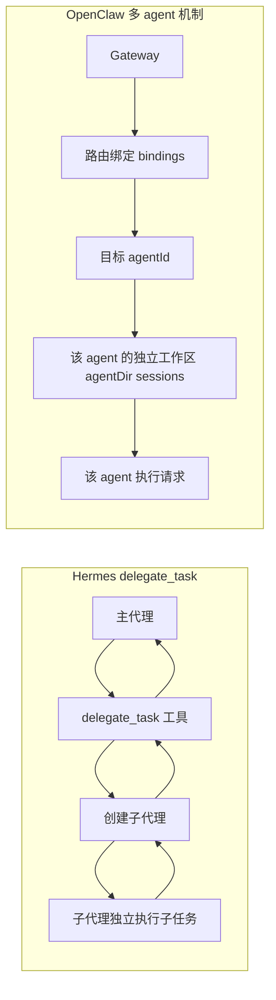

---

## 15. Hermes 对外通讯总图

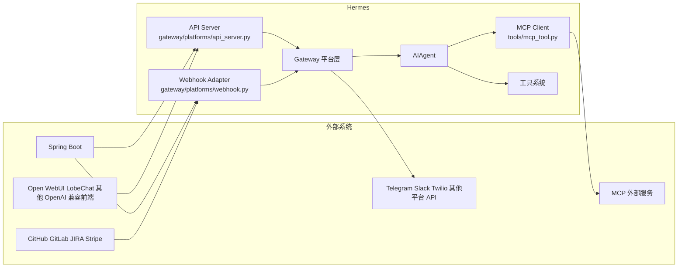

---

## 16. 外部请求 Hermes 的架构图

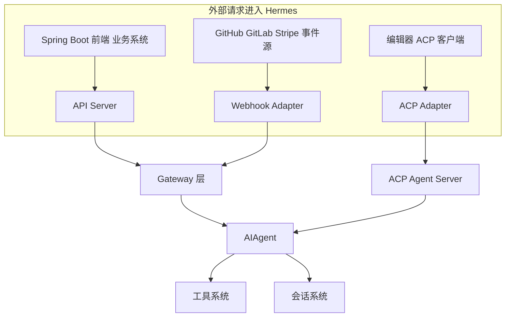

---

## 17. Hermes 主动访问外部服务的架构图

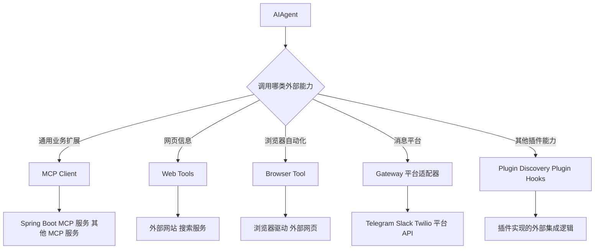

---

## 18. Spring Boot 接入 Hermes 方案总览图

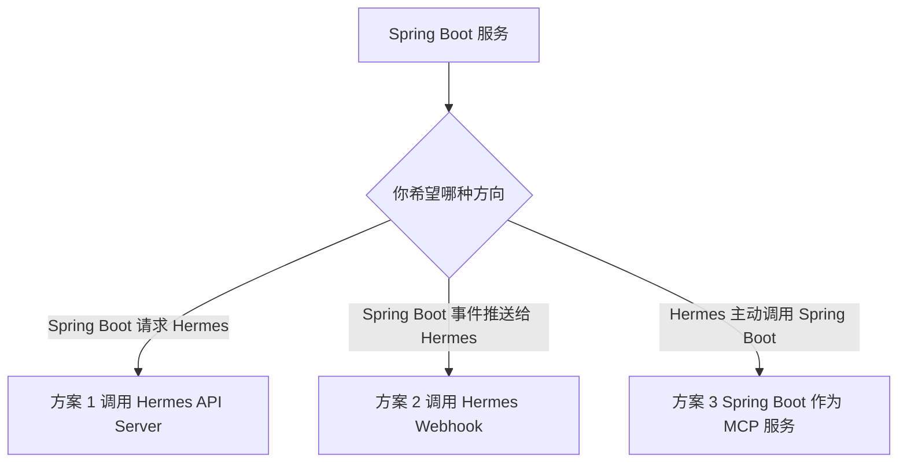

---

## 19. Spring Boot 调用 Hermes API Server 时序图

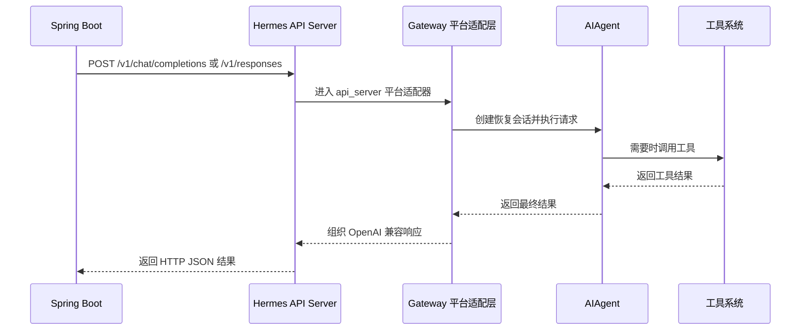

---

## 20. Spring Boot 推送事件到 Hermes Webhook 时序图

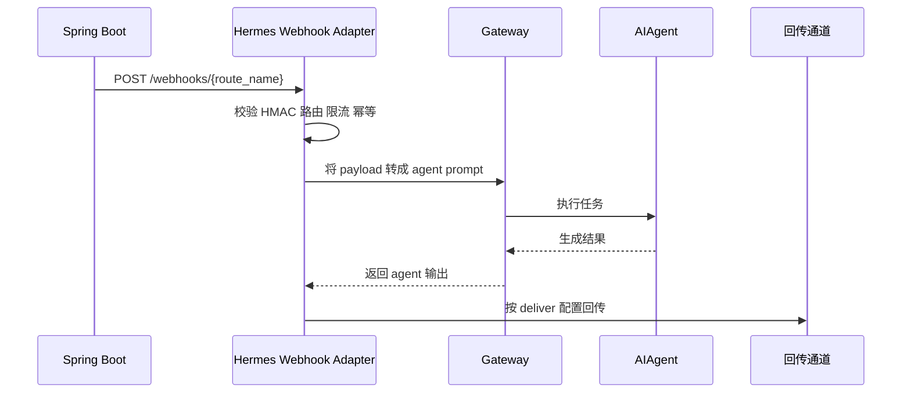

---

## 21. Hermes 通过 MCP 调用 Spring Boot 时序图

```mermaid
sequenceDiagram
    participant Hermes as Hermes Agent
    participant MCPClient as Hermes MCP Client
    participant SpringMCP as Spring Boot MCP 服务
    participant Registry as 工具注册中心
    participant Model as 模型

    Hermes->>MCPClient: 启动时读取 mcp_servers 配置
    MCPClient->>SpringMCP: 连接 HTTP StreamableHTTP MCP 服务
    SpringMCP-->>MCPClient: 返回可用工具列表
    MCPClient->>Registry: 注册外部 MCP 工具
    Registry-->>Hermes: 外部工具进入可调用工具面

    Model->>Hermes: 请求调用某个 MCP 工具
    Hermes->>MCPClient: 执行 MCP 工具调用
    MCPClient->>SpringMCP: 发起工具请求
    SpringMCP-->>MCPClient: 返回结果
    MCPClient-->>Hermes: 返回工具结果
    Hermes-->>Model: 回填结果继续推理
```

---

## 22. example-spring-client 调用链路图

```mermaid
flowchart LR
    A[客户端] --> B[HermesDemoController]
    B --> C[HermesApiService RestTemplate]
    B --> D[HermesWebClientService WebClient]
    C --> E[Hermes API Server 或 Webhook]
    D --> E
    E --> F[Hermes Agent]
```

---

## 23. example-spring-mcp-server 工具调用图

```mermaid
flowchart TD
    A[Hermes MCP Client] --> B[POST /mcp]
    B --> C[McpController]
    C --> D{method}
    D -- initialize --> E[initialize]
    D -- tools/list --> F[toolsList]
    D -- tools/call --> G[toolsCall]
    D -- ping --> H[ping]

    G --> I{tool name}
    I -- query_order --> J[查询订单表]
    I -- query_user --> K[查询用户表]
    I -- approve_order --> L[更新订单状态与审批人]
```

---

## 24. example-spring-mcp-server 数据状态变化图

```mermaid
sequenceDiagram
    participant Hermes as Hermes 或调用方
    participant MCP as MCP Server
    participant Orders as 订单内存表
    participant Users as 用户内存表

    Hermes->>MCP: tools/call query_order A10086
    MCP->>Orders: 查询 A10086
    Orders-->>MCP: userId U20001 status PENDING_APPROVAL
    MCP->>Users: 查询 U20001
    Users-->>MCP: Alice VIP LOW
    MCP-->>Hermes: 返回订单 用户关联结果

    Hermes->>MCP: tools/call approve_order A10086 finance_manager
    MCP->>Orders: 更新状态 APPROVED 更新审批人
    Orders-->>MCP: 写入成功
    MCP-->>Hermes: 返回审批成功结果

    Hermes->>MCP: tools/call query_order A10086
    MCP->>Orders: 再次查询 A10086
    Orders-->>MCP: status APPROVED approvedBy finance_manager
    MCP-->>Hermes: 返回更新后的订单结果
```

---

## 25. 使用建议

团队后续建议这样使用这份图谱文档：

1. 看 Hermes 总体设计时，先看第 1 到第 8 张图
2. 看工具和子代理机制时，重点看第 9 到第 14 张图
3. 看外部通讯和 Spring 对接时，重点看第 15 到第 24 张图
4. 后续新增图时，尽量按“核心架构 / 工具机制 / 外部通讯 / 示例工程”四组继续追加