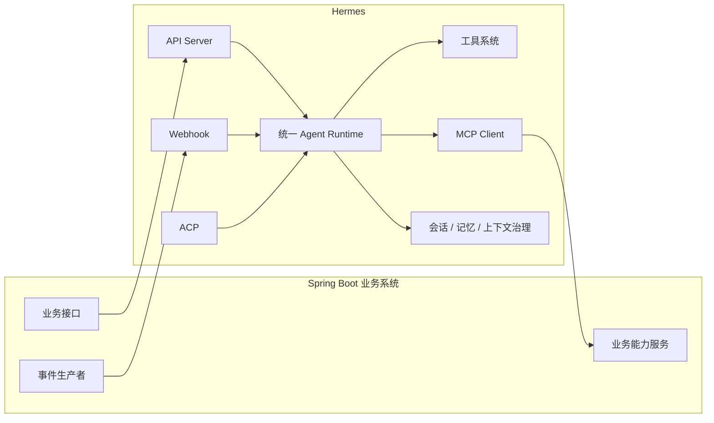
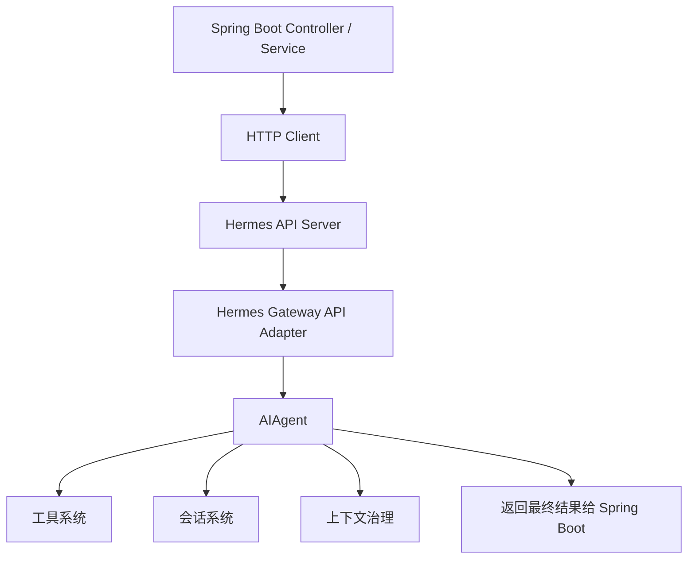
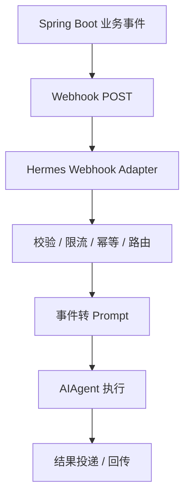
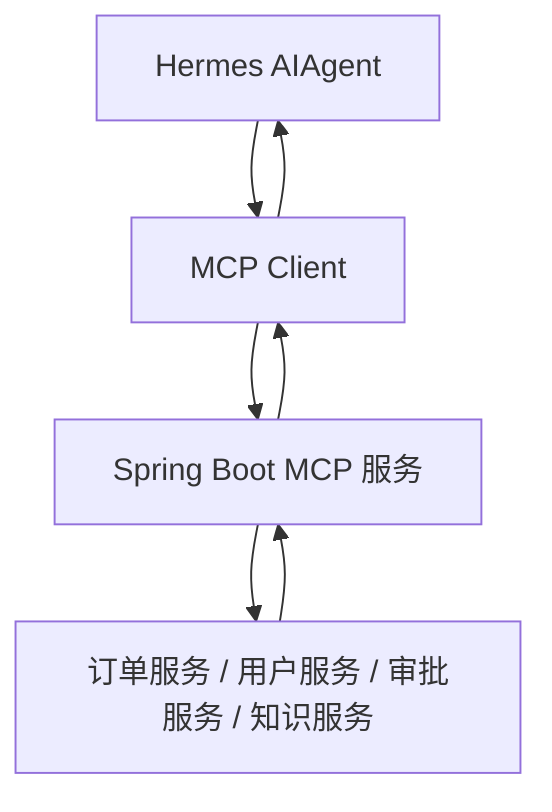
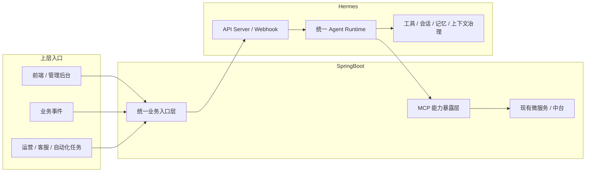

# Hermes 与 Spring Boot 交互控制架构图

如果团队要真正把 Hermes 和 Spring Boot 接起来，最重要的不是先看代码，而是先把交互方向看清楚。

### 1. 总体交互控制图

### 2. Spring Boot -> Hermes 的服务化调用架构图

### 3. Spring Boot -> Hermes 的事件驱动架构图

### 4. Hermes -> Spring Boot 的能力调用架构图

### 5. 最终推荐架构图

一句话解释：

**Spring Boot 保持业务中心不变，Hermes 作为智能编排层接进来，再通过 MCP 回连到 Spring Boot 的业务能力。**

---
