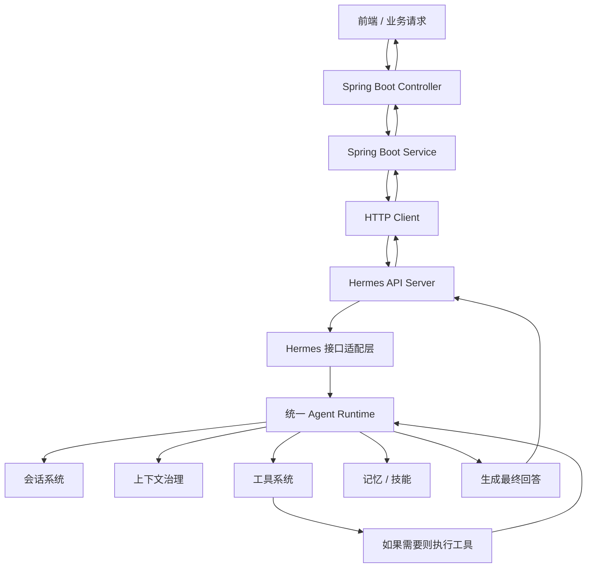
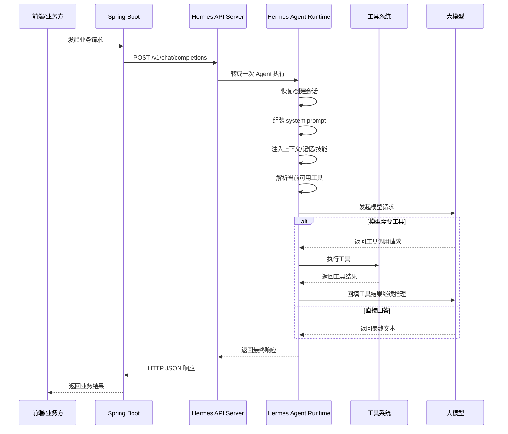
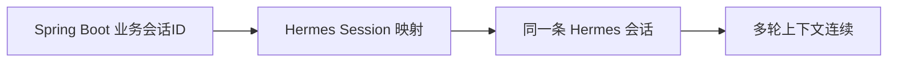

# Spring Boot 调 Hermes 的完整调用链路图

下面这张图最适合团队理解整体路径。

## 最常见同步调用链路图

这张图的意思是：

- Spring Boot 并不是直接调模型
- 而是调 Hermes 的服务入口
- Hermes 内部再统一进入 Agent Runtime
- Agent Runtime 再决定要不要用工具、会话、记忆等能力

## 更细一点的内部调用链路图

这张图最关键的一点是：

**Hermes 内部是“模型推理 + 工具执行 + 再推理”的 Agent 循环，而不是一次裸模型调用。**

## 如果你要做会话连续，链路上要多理解一层

如果 Spring Boot 每次都只发一个独立请求，Hermes 就容易把它当成一次新任务。
如果你想让多轮请求连起来，Spring Boot 需要自己持有并传递：

- 业务会话 id
- 或 Hermes 会话关联信息

这时链路会变成：

## 一句话理解整条调用链

**Spring Boot 负责把业务请求送进 Hermes，Hermes 负责把这个请求变成一次完整的 Agent 执行过程，再把最终结果回给 Spring Boot。**
