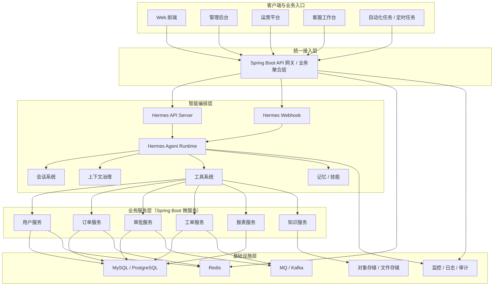

# Hermes 与 Spring Boot 的推荐企业架构图

最推荐的企业架构，不是把 Hermes 硬塞进 Spring Boot 里，而是：

**Spring Boot 继续做稳定业务层，Hermes 作为独立智能编排层。**

## 推荐企业总体架构图

## 核心理解

1. 前端不要直接大面积碰 Hermes，更推荐先走 Spring Boot。
2. Hermes 放在“智能编排层”，最适合负责任务理解、会话和工具编排。
3. Spring Boot 微服务继续做业务层，承接订单、用户、审批、工单等正式业务能力。
4. Hermes 通过工具系统回连业务服务，推荐优先使用 MCP 或受控服务接口。

## 一句话版建议

**前端和业务入口先走 Spring Boot，Hermes 作为独立智能编排层接在 Spring Boot 之后，再通过 MCP 或受控服务接口回连 Spring Boot 业务微服务。**
