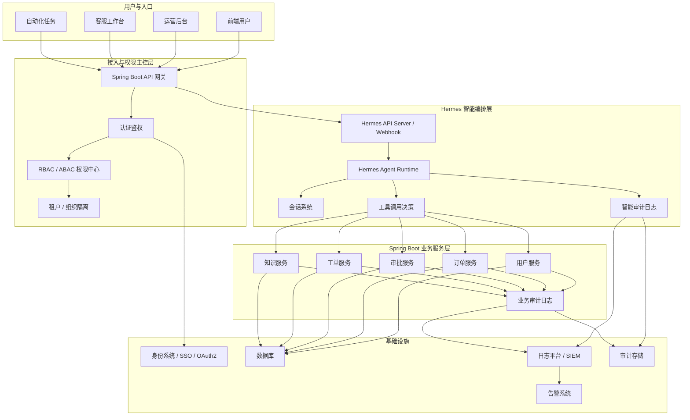

# Hermes 与 Spring Boot 权限与审计架构图

最推荐的做法是：

**权限主控仍然放在 Spring Boot 业务层，Hermes 不直接成为权限中心；Hermes 负责记录“智能决策过程”，Spring Boot 负责记录“正式业务操作审计”。**

## 推荐权限与审计总体架构图

## 权限边界一句话版

**Hermes 可以感知权限上下文，但 Spring Boot 负责最终权限裁决。**

## 审计边界一句话版

**Hermes 记录“智能过程”，Spring Boot 记录“正式业务操作”。**
