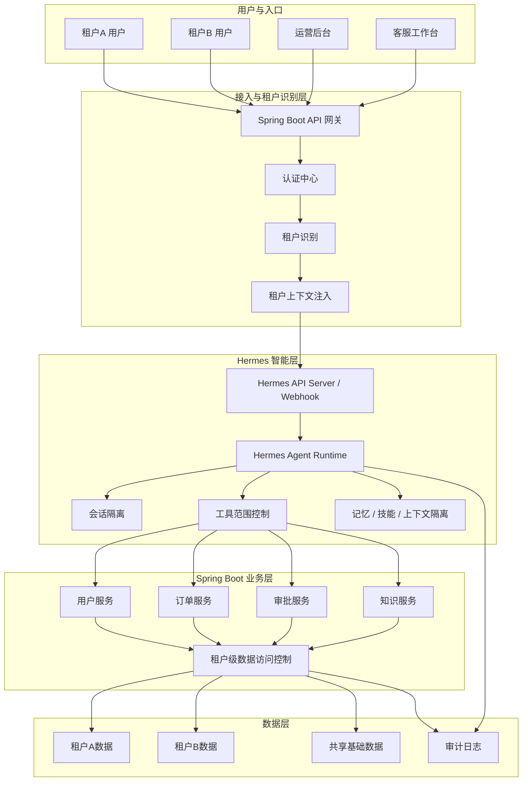

# Hermes 与 Spring Boot 多租户隔离架构图

最推荐的做法是：

**由 Spring Boot 负责租户识别和最终数据隔离，Hermes 负责会话、工具、记忆和上下文的租户感知与范围收敛。**

## 推荐的多租户总体架构图

## 核心理解

1. 租户识别先在 Spring Boot 做。
2. Hermes 负责“租户感知”，不是租户裁决中心。
3. 最终数据隔离仍在 Spring Boot 业务层做。
4. 会话、记忆、工具范围和上下文都建议按租户做隔离。

## 一句话总结

**租户先识别，再智能处理，最后由业务层做最终隔离。**
