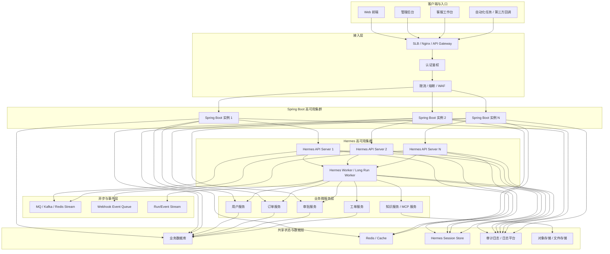

# Hermes 与 Spring Boot 高可用架构图

最推荐的高可用思路是：

**Spring Boot 和 Hermes 都做无状态服务化部署，会话与审计落到外部存储，长任务与事件流走队列或事件通道，前面统一接入网关与负载均衡。**

## 推荐的高可用总体架构图

## 核心理解

1. Spring Boot 和 Hermes 都做集群，不要单实例。
2. Hermes 尽量无状态化，关键状态必须外置。
3. 长任务和异步任务不要卡死在同步请求里。
4. API 层和 Worker 层建议拆开部署。

## 一句话总结

**前面统一接入，Spring Boot 做业务入口，Hermes 分成 API 集群和 Worker 集群，状态全部外置。**
