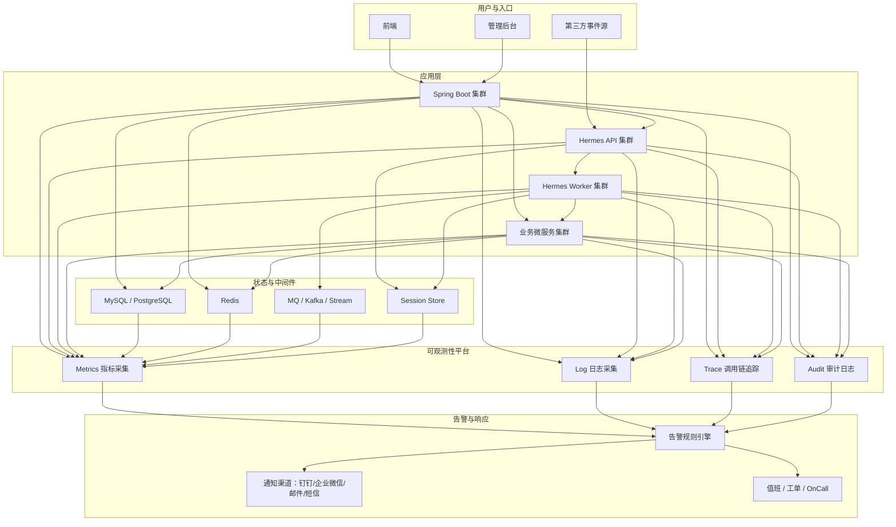

# Hermes 与 Spring Boot 监控告警架构图

最推荐的做法是：

**Spring Boot、Hermes API、Hermes Worker、业务微服务统一接入同一套监控与日志平台；指标、日志、链路、审计分层采集，最后统一汇聚到告警中心。**

## 推荐的监控告警总体架构图

## 核心理解

1. 指标监控看系统健康。
2. 日志看发生了什么。
3. 调用链看问题卡在哪一跳。
4. 审计看谁做了什么。
5. 告警建议至少分可用性、性能、错误率、任务积压和安全审计 5 类。

## 一句话总结

**所有层都接入统一监控平台，最后由统一告警中心做通知和响应。**
