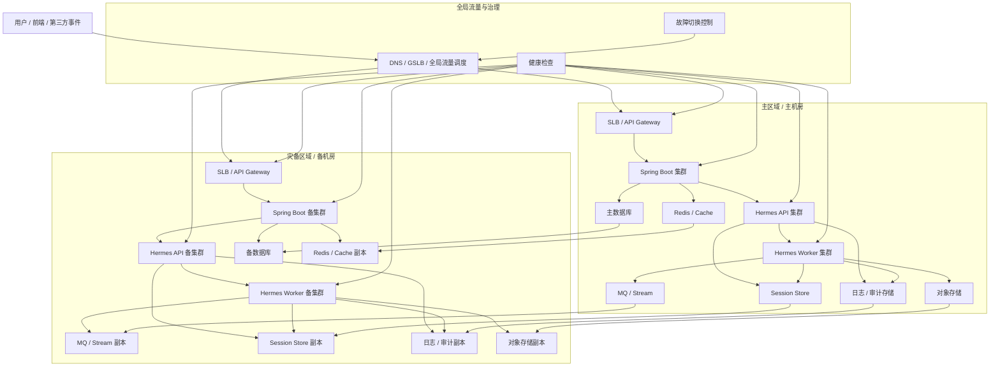

# Hermes 与 Spring Boot 灾备架构图

最推荐的灾备思路是：

**应用双活或主备、状态多副本、会话与审计外置、对象存储跨区域复制、消息队列可恢复、数据库主从或多活，并通过流量切换能力把 Spring Boot 和 Hermes 一起做成可切换的整体。**

## 推荐的灾备总体架构图

## 核心理解

1. 灾备不是只备 Spring Boot，也要备 Hermes。
2. Hermes 的状态必须外置，否则灾备切换很难做。
3. 主备切换要把“应用 + 状态 + 流量”一起切。
4. Session、Run、MQ、日志和对象存储都应该进入灾备范围。

## 一句话总结

**主区域负责正常服务，灾备区域保持可接管，状态持续复制，故障时通过全局流量调度整体切换。**
